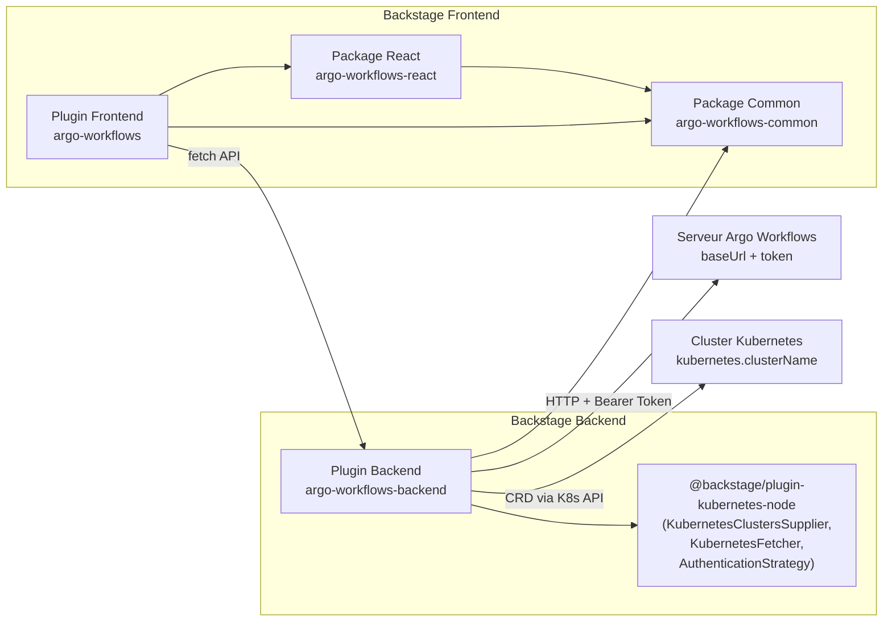
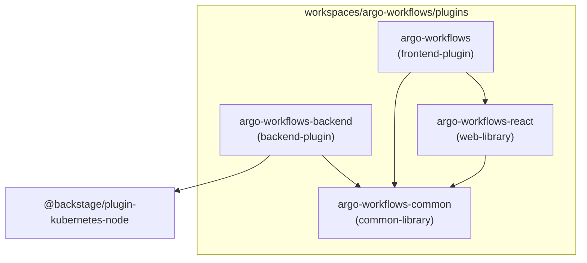
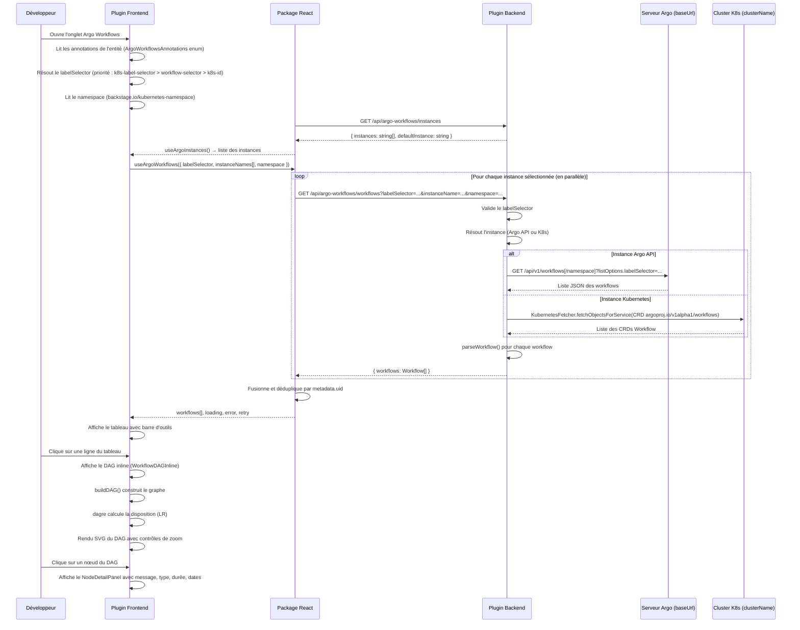

# Document de conception — Plugin Argo Workflows pour Backstage

## Vue d'ensemble

Ce document décrit la conception technique du plugin Backstage communautaire pour Argo Workflows. Le plugin suit la convention ADR011 de Backstage avec quatre packages (frontend, backend, common, react) et s'inspire de l'architecture du plugin Tekton communautaire.

Le plugin permet aux développeurs de :

- Visualiser la liste des exécutions de workflows Argo associées à un composant du catalogue Backstage, avec filtrage par statut, recherche par nom et sélection multi-instances
- Explorer le graphe DAG (Directed Acyclic Graph) interactif de chaque exécution en mode inline (expansible dans le tableau) avec panneau de détail des nœuds
- Accéder aux données via un proxy backend sécurisé supportant deux sources de données : l'API Argo Workflows (baseUrl/token) et l'API Kubernetes via le plugin Backstage Kubernetes (`@backstage/plugin-kubernetes-node`)

Le backend sert de couche d'abstraction sécurisée entre le frontend Backstage et les sources de données, évitant l'exposition des credentials au navigateur. Le frontend utilise une stratégie d'annotations Tekton-style avec un enum `ArgoWorkflowsAnnotations` regroupant les annotations CICD gate et les annotations standard Kubernetes.

## Architecture

### Vue d'ensemble de l'architecture



### Structure des packages (ADR011)



| Package                  | Rôle Backstage    | Nom npm                                              | Responsabilité                                                          |
| ------------------------ | ----------------- | ---------------------------------------------------- | ----------------------------------------------------------------------- |
| `argo-workflows`         | `frontend-plugin` | `@backstage-community/plugin-argo-workflows`         | Plugin UI principal, onglet entité, routage, tableau, DAG inline        |
| `argo-workflows-backend` | `backend-plugin`  | `@backstage-community/plugin-argo-workflows-backend` | Proxy API dual (Argo API + K8s API), authentification, routage REST     |
| `argo-workflows-common`  | `common-library`  | `@backstage-community/plugin-argo-workflows-common`  | Enum annotations, types partagés, fonctions de sérialisation            |
| `argo-workflows-react`   | `web-library`     | `@backstage-community/plugin-argo-workflows-react`   | Composants React réutilisables, hooks (instances, workflows), DAG build |

### Flux de données



### Décisions de conception

1. **Enum `ArgoWorkflowsAnnotations` (stratégie Tekton-style)** : Toutes les clés d'annotations sont regroupées dans un enum TypeScript unique exporté par le package common. Cela inclut l'annotation CICD gate (`argoworkflows.argoproj.io/workflow`), les annotations spécifiques au plugin (`workflow-selector`, `instance-name`) et les annotations standard Kubernetes (`backstage.io/kubernetes-id`, `backstage.io/kubernetes-namespace`, `backstage.io/kubernetes-label-selector`). Les constantes dépréciées sont conservées pour la rétrocompatibilité.

2. **Dual backend : Argo API + Kubernetes API** : Chaque instance configurée peut utiliser soit l'API Argo Workflows directe (`baseUrl` + `token`), soit l'API Kubernetes via l'infrastructure du plugin Backstage Kubernetes (`KubernetesClustersSupplier`, `KubernetesFetcher`, `AuthenticationStrategy`). Les deux chemins sont mutuellement exclusifs par instance.

3. **Requêtes scopées par namespace** : L'annotation `backstage.io/kubernetes-namespace` permet de limiter les requêtes à un namespace spécifique. Quand elle est absente, les requêtes sont cluster-wide. Le namespace est propagé du frontend au backend via un paramètre de requête.

4. **Endpoint `GET /instances`** : Un endpoint dédié retourne la liste des noms d'instances configurées et l'instance par défaut. Cela permet au frontend d'afficher un sélecteur multi-instances sans connaître la configuration backend.

5. **Multi-instance parallel fetching avec déduplication** : Le hook `useArgoWorkflows` accepte un paramètre `instanceNames[]` et récupère les workflows de chaque instance en parallèle. Les résultats sont fusionnés et dédupliqués par `metadata.uid` pour éviter les doublons.

6. **dagre pour la disposition du DAG** : Bibliothèque éprouvée déjà utilisée par le plugin Tekton. Calcule automatiquement les positions des nœuds en respectant l'ordre topologique (gauche à droite).

7. **@backstage/ui (BUI) pour les composants UI** : Le plugin utilise le design system officiel Backstage UI (`@backstage/ui`) pour tous les composants d'interface. Les icônes utilisent Remix Icons (`@remixicon/react`). Les tokens CSS BUI (`--bui-*`) garantissent la cohérence avec le thème Backstage et le support du mode sombre.

8. **DAG inline avec panneau de détail** : Au lieu d'une page de détail séparée, le DAG est affiché en mode inline sous la ligne du tableau. Un clic sur un nœud ouvre un panneau de détail latéral avec le message d'erreur, le type, la durée et les dates.

9. **Fixtures JSON** : Les données de test sont stockées en fichiers JSON individuels (un par workflow) plutôt qu'en objets TypeScript. Un fichier `workflows.ts` importe les JSON et les exporte typés. Cela facilite la maintenance et la lisibilité.

10. **Package React séparé** : Permet à des plugins tiers de réutiliser les composants de visualisation (icônes de statut, construction du DAG, hooks) sans dépendre du plugin frontend complet.

## Composants et interfaces

### Package Common (`argo-workflows-common`)

```typescript
// annotations.ts
export enum ArgoWorkflowsAnnotations {
  CICD = 'argoworkflows.argoproj.io/workflow',
  LABEL_SELECTOR = 'argoworkflows.argoproj.io/workflow-selector',
  INSTANCE_NAME = 'argoworkflows.argoproj.io/instance-name',
  KUBERNETES_ID = 'backstage.io/kubernetes-id',
  KUBERNETES_NAMESPACE = 'backstage.io/kubernetes-namespace',
  KUBERNETES_LABEL_SELECTOR = 'backstage.io/kubernetes-label-selector',
}

/** @deprecated Utiliser ArgoWorkflowsAnnotations.LABEL_SELECTOR */
export const ARGO_WORKFLOWS_LABEL_SELECTOR_ANNOTATION =
  ArgoWorkflowsAnnotations.LABEL_SELECTOR;

/** @deprecated Utiliser ArgoWorkflowsAnnotations.INSTANCE_NAME */
export const ARGO_WORKFLOWS_INSTANCE_ANNOTATION =
  ArgoWorkflowsAnnotations.INSTANCE_NAME;

// utils.ts
import { Entity } from '@backstage/catalog-model';

/**
 * Retourne true si l'entité possède au moins une annotation d'activation :
 * - CICD = "true"
 * - LABEL_SELECTOR non vide
 * - KUBERNETES_LABEL_SELECTOR non vide
 * - KUBERNETES_ID non vide
 */
export function isArgoWorkflowsAvailable(entity: Entity): boolean;

// serialization.ts
export function parseWorkflow(raw: Record<string, unknown>): Workflow;
export function formatWorkflow(workflow: Workflow): Record<string, unknown>;
```

### Package React (`argo-workflows-react`)

```typescript
// components/WorkflowStatusIcon.tsx
export interface WorkflowStatusIconProps {
  status: WorkflowStatus;
  size?: 'small' | 'medium' | 'large';
}
export const WorkflowStatusIcon: React.FC<WorkflowStatusIconProps>;

// components/WorkflowStatusBadge.tsx
export interface WorkflowStatusBadgeProps {
  status: WorkflowStatus;
}
export const WorkflowStatusBadge: React.FC<WorkflowStatusBadgeProps>;

// hooks/useArgoInstances.ts
export function useArgoInstances(): {
  instances: string[];
  defaultInstance?: string;
  loading: boolean;
};

// hooks/useArgoWorkflows.ts
export function useArgoWorkflows(options: {
  labelSelector: string;
  instanceName?: string;
  instanceNames?: string[]; // Récupération parallèle multi-instances
  namespace?: string;
}): {
  workflows: Workflow[];
  loading: boolean;
  error: Error | undefined;
  retry: () => void;
};

// hooks/useArgoWorkflowDetail.ts
export function useArgoWorkflowDetail(options: {
  namespace: string;
  name: string;
  instanceName?: string;
}): {
  workflow: Workflow | undefined;
  loading: boolean;
  error: Error | undefined;
};

// utils/buildDAG.ts
export interface DAGNode {
  id: string;
  label: string;
  status: WorkflowStatus;
  startedAt?: string;
  finishedAt?: string;
  duration?: number;
  type: string;
  message?: string; // Champ message pour le panneau de détail
}

export interface DAGEdge {
  source: string;
  target: string;
}

export interface DAGGraph {
  nodes: DAGNode[];
  edges: DAGEdge[];
}

export function buildDAG(workflow: Workflow): DAGGraph;
```

### Plugin Frontend (`argo-workflows`)

```typescript
// plugin.ts
export const argoWorkflowsPlugin = createPlugin({ id: 'argo-workflows' });
export const ArgoWorkflowsCI = argoWorkflowsPlugin.provide(
  createComponentExtension({
    name: 'ArgoWorkflowsCI',
    component: {
      lazy: () => import('./components/Router').then(m => m.Router),
    },
  }),
);

// components/Router.tsx
// Résout le labelSelector avec ordre de priorité :
// 1. backstage.io/kubernetes-label-selector (priorité la plus élevée)
// 2. argoworkflows.argoproj.io/workflow-selector
// 3. backstage.io/kubernetes-id → construit "backstage.io/kubernetes-id=<valeur>"
// Lit le namespace depuis backstage.io/kubernetes-namespace
// Lit l'instanceName depuis argoworkflows.argoproj.io/instance-name
// Appelle useArgoInstances() pour la liste des instances disponibles
export const Router: React.FC;

// components/WorkflowRunsTable.tsx
// Tableau avec barre d'outils : titre "Workflows", sélecteur multi-instances (Select),
// filtres de statut (ToggleButtonGroup), champ de recherche (SearchField),
// horodatage "Updated just now" avec dot vert
// Indicateur d'expansion RiArrowRightSLine avec rotation 90° CSS
// Colonnes : expand, nom, namespace, statut, task status (barre), durée, date de début
// Pagination par défaut : 5 lignes, options 5/10/25/50
// Tri par défaut : date de début décroissante
export const WorkflowRunsTable: React.FC<WorkflowRunsTableProps>;

// components/TaskStatusBar.tsx
// Barre horizontale empilée montrant la proportion des statuts des tâches (Pod nodes)
export const TaskStatusBar: React.FC<TaskStatusBarProps>;

// components/WorkflowDAGInline.tsx
// DAG inline affiché sous le tableau quand une ligne est expansée
// Contrôles de zoom : RiAddLine (zoom in), RiSubtractLine (zoom out), RiFullscreenLine (fit)
// Positionnés en bas à gauche du conteneur
// Clic sur un nœud ouvre le NodeDetailPanel
export const WorkflowDAGInline: React.FC<WorkflowDAGInlineProps>;

// components/WorkflowDAGView.tsx
// Vue DAG pleine page avec chargement via useArgoWorkflowDetail
// Mêmes contrôles de zoom et panneau de détail que DAGInline
export const WorkflowDAGView: React.FC<WorkflowDAGViewProps>;

// components/NodeDetailPanel.tsx
// Panneau de détail d'un nœud : nom avec icône de statut, type, durée, dates
// Message dans un encadré stylisé (monospace, fond rose pour Failed/Error)
// Paires clé/valeur en disposition horizontale (inline) avec labels de largeur fixe
export const NodeDetailPanel: React.FC<NodeDetailPanelProps>;
```

### Plugin Backend (`argo-workflows-backend`)

```typescript
// config.d.ts — Schéma de configuration
export interface Config {
  argoWorkflows?: {
    defaultInstance?: string;
    instances?: Array<{
      name: string;
      baseUrl?: string; // Mutuellement exclusif avec kubernetes
      token?: string; // Requis quand baseUrl est défini
      kubernetes?: {
        clusterName: string; // Mutuellement exclusif avec baseUrl/token
      };
    }>;
  };
}

// service/ArgoWorkflowsService.ts
export interface ArgoWorkflowsServiceOptions {
  config: RootConfigService;
  logger: LoggerService;
  clusterSupplier?: KubernetesClustersSupplier; // Requis pour les instances K8s
  fetcher?: KubernetesFetcher; // Requis pour les instances K8s
  authStrategy?: AuthenticationStrategy; // Requis pour les instances K8s
}

export class ArgoWorkflowsService {
  constructor(options: ArgoWorkflowsServiceOptions);
  getInstanceNames(): string[];
  getDefaultInstance(): string | undefined;
  listWorkflows(
    instanceName: string,
    labelSelector: string,
    namespace?: string,
    credentials?: BackstageCredentials,
  ): Promise<Workflow[]>;
  getWorkflow(
    instanceName: string,
    namespace: string,
    name: string,
    credentials?: BackstageCredentials,
  ): Promise<Workflow>;
}

export function validateLabelSelector(selector: string): string | undefined;

// router.ts — Routes Express
// GET /instances → { instances: string[], defaultInstance?: string }
// GET /workflows?labelSelector=...&instanceName=...&namespace=... → { workflows: Workflow[] }
// GET /workflows/:namespace/:name?instanceName=... → Workflow

// plugin.ts
export const argoWorkflowsBackendPlugin = createBackendPlugin({
  pluginId: 'argo-workflows',
  register(env) {
    env.registerInit({
      deps: { config, httpAuth, httpRouter, logger },
      async init({ config, httpAuth, httpRouter, logger }) {
        httpRouter.use(await createRouter({ config, httpAuth, logger }));
      },
    });
  },
});
```

### Configuration `app-config.yaml`

```yaml
kubernetes:
  clusters:
    - name: production
      url: https://k8s-prod.example.com
      serviceAccountToken: ${K8S_PROD_TOKEN}
      authProvider: serviceAccount
    - name: staging
      url: https://k8s-staging.example.com
      serviceAccountToken: ${K8S_STAGING_TOKEN}
      authProvider: serviceAccount

argoWorkflows:
  defaultInstance: argo-server
  instances:
    # Option A : API Argo Workflows directe
    - name: argo-server
      baseUrl: https://argo.example.com
      token: ${ARGO_TOKEN}
    # Option B : API Kubernetes via plugin Backstage K8s
    - name: k8s-production
      kubernetes:
        clusterName: production
    - name: k8s-staging
      kubernetes:
        clusterName: staging
```

### Annotations d'entité catalogue

```yaml
apiVersion: backstage.io/v1alpha1
kind: Component
metadata:
  name: my-service
  annotations:
    # Porte d'entrée CICD (Tekton-style)
    argoworkflows.argoproj.io/workflow: 'true'
    # Sélecteur de labels (priorité 2)
    argoworkflows.argoproj.io/workflow-selector: 'app=my-service'
    # Instance spécifique (optionnel)
    argoworkflows.argoproj.io/instance-name: argo-server
    # Namespace Kubernetes (optionnel, scope les requêtes)
    backstage.io/kubernetes-namespace: production
    # OU annotations standard Kubernetes (alternatives)
    # backstage.io/kubernetes-label-selector: 'app=my-service' (priorité 1)
    # backstage.io/kubernetes-id: my-service (priorité 3, converti en label selector)
```

## Modèles de données

### Types TypeScript partagés (Package Common)

```typescript
/** Statut d'exécution d'un workflow ou d'un nœud */
export type WorkflowStatus =
  | 'Pending'
  | 'Running'
  | 'Succeeded'
  | 'Failed'
  | 'Error';

/** Métadonnées Kubernetes d'un workflow */
export interface WorkflowMetadata {
  name: string;
  namespace: string;
  uid: string;
  labels?: Record<string, string>;
  annotations?: Record<string, string>;
  creationTimestamp: string;
}

/** Nœud individuel dans le DAG d'un workflow */
export interface WorkflowNode {
  id: string;
  name: string;
  displayName: string;
  type: 'Pod' | 'Steps' | 'StepGroup' | 'DAG' | 'Retry' | 'Skipped' | 'Suspend';
  phase: WorkflowStatus;
  startedAt?: string;
  finishedAt?: string;
  children?: string[];
  message?: string;
  templateName?: string;
}

/** Statut global d'un workflow */
export interface WorkflowStatusDetail {
  phase: WorkflowStatus;
  startedAt?: string;
  finishedAt?: string;
  nodes?: Record<string, WorkflowNode>;
  message?: string;
}

/** Modèle principal d'un workflow Argo */
export interface Workflow {
  metadata: WorkflowMetadata;
  status: WorkflowStatusDetail;
}

/** Réponse de la liste des workflows */
export interface WorkflowListResponse {
  workflows: Workflow[];
}
```

### Mapping des couleurs de statut

Les couleurs utilisent les tokens CSS de `@backstage/ui` (variables `--bui-*`) pour garantir la cohérence avec le thème Backstage et le support du mode sombre.

| WorkflowStatus | Couleur   | Token BUI CSS        | Icône Remix           |
| -------------- | --------- | -------------------- | --------------------- |
| `Pending`      | Gris      | `--bui-fg-secondary` | RiTimeLine            |
| `Running`      | Bleu/Info | `--bui-fg-info`      | RiLoader4Line (animé) |
| `Succeeded`    | Vert      | `--bui-fg-success`   | RiCheckboxCircleLine  |
| `Failed`       | Rouge     | `--bui-fg-danger`    | RiCloseCircleLine     |
| `Error`        | Rouge     | `--bui-fg-danger`    | RiErrorWarningLine    |

### Schéma de validation `parseWorkflow`

Champs obligatoires pour `parseWorkflow` :

- `metadata.name` (string)
- `metadata.namespace` (string)
- `status.phase` (WorkflowStatus valide)

Champs optionnels : tous les autres champs sont extraits s'ils sont présents, ignorés sinon. Les champs inconnus de la réponse JSON brute sont silencieusement ignorés.

### Types d'instances backend

```typescript
/** Instance configurée avec l'API Argo Workflows directe */
interface ArgoApiInstance {
  kind: 'argo-api';
  name: string;
  baseUrl: string;
  token: string;
}

/** Instance configurée via le plugin Backstage Kubernetes */
interface KubernetesClusterInstance {
  kind: 'kubernetes';
  name: string;
  clusterName: string;
}

type ArgoInstance = ArgoApiInstance | KubernetesClusterInstance;
```

## Propriétés de correction

_Une propriété est une caractéristique ou un comportement qui doit rester vrai pour toutes les exécutions valides d'un système — essentiellement, une déclaration formelle de ce que le système doit faire. Les propriétés servent de pont entre les spécifications lisibles par l'humain et les garanties de correction vérifiables par la machine._

### Propriété 1 : Disponibilité du plugin basée sur les annotations

_Pour toute_ entité du catalogue Backstage, `isArgoWorkflowsAvailable(entity)` retourne `true` si et seulement si au moins une des conditions suivantes est remplie : l'annotation `argoworkflows.argoproj.io/workflow` vaut `"true"`, ou l'annotation `argoworkflows.argoproj.io/workflow-selector` est une chaîne non vide (après trim), ou l'annotation `backstage.io/kubernetes-label-selector` est une chaîne non vide (après trim), ou l'annotation `backstage.io/kubernetes-id` est une chaîne non vide (après trim).

**Valide : Exigences 2.1, 2.2, 2.3, 2.4, 2.5, 2.6**

### Propriété 2 : Round-trip de sérialisation des workflows

_Pour tout_ objet `Workflow` valide, l'application successive de `formatWorkflow` puis `parseWorkflow` produit un objet équivalent à l'objet initial. Les champs inconnus présents dans la source JSON sont ignorés sans erreur.

**Valide : Exigences 14.3, 14.4**

### Propriété 3 : Erreur descriptive pour champs obligatoires manquants

_Pour toute_ réponse JSON brute à laquelle il manque au moins un des champs obligatoires (`metadata.name`, `metadata.namespace`, `status.phase`), `parseWorkflow` lève une erreur dont le message contient le nom de chaque champ manquant.

**Valide : Exigence 14.5**

### Propriété 4 : Invariant du nombre de nœuds du DAG

_Pour tout_ objet `Workflow` valide contenant `status.nodes`, le graphe DAG produit par `buildDAG` contient exactement autant de nœuds que d'entrées dans `status.nodes`.

**Valide : Exigences 13.1, 13.3**

### Propriété 5 : Correspondance des arêtes du DAG avec les dépendances

_Pour tout_ objet `Workflow` valide, chaque relation parent→enfant déclarée dans le champ `children` d'un `WorkflowNode` correspond à exactement une arête orientée dans le graphe DAG produit par `buildDAG`, et le graphe ne contient aucune arête supplémentaire. Les nœuds qui ne sont enfants d'aucun autre nœud n'ont aucune arête entrante (nœuds racines).

**Valide : Exigences 13.2, 13.6**

### Propriété 6 : Détection de cycles dans le DAG

_Pour tout_ objet `Workflow` dont les relations `children` contiennent au moins un cycle, `buildDAG` lève une erreur descriptive indiquant la présence d'un cycle au lieu de produire un graphe invalide.

**Valide : Exigence 13.4**

### Propriété 7 : Validité topologique du DAG

_Pour tout_ graphe DAG construit par `buildDAG` à partir d'un `Workflow` valide (acyclique), un tri topologique du graphe est possible sans erreur.

**Valide : Exigence 13.5**

### Propriété 8 : Validation du sélecteur de labels Kubernetes

_Pour toute_ chaîne de caractères fournie comme `labelSelector`, le Plugin_Backend accepte la requête si et seulement si la chaîne est un sélecteur de labels Kubernetes valide (conforme à la syntaxe `key=value`, `key!=value`, `key in (v1,v2)`, `key notin (v1,v2)`, `key`, `!key`, ou une combinaison séparée par des virgules). Les chaînes vides ou invalides sont rejetées avec une erreur HTTP 400.

**Valide : Exigence 5.8**

### Propriété 9 : Tri des exécutions par date décroissante

_Pour toute_ liste de workflows retournée au frontend, le tri par défaut produit un ordre décroissant par `status.startedAt` (le plus récent en premier).

**Valide : Exigence 8.11**

### Propriété 10 : Complétude et accessibilité de WorkflowStatusIcon

_Pour toute_ valeur valide de `WorkflowStatus` (`Pending`, `Running`, `Succeeded`, `Failed`, `Error`), le composant `WorkflowStatusIcon` retourne un élément React non nul possédant un attribut `aria-label` descriptif et non vide.

**Valide : Exigences 15.3, 15.4**

### Propriété 11 : Déduplication des workflows par uid

_Pour toute_ collection de listes de workflows provenant de différentes instances, la fusion par `useArgoWorkflows` produit une liste où chaque `metadata.uid` apparaît exactement une fois. L'ordre de priorité est premier arrivé, premier conservé.

**Valide : Exigences 7.3, 7.4**

## Gestion des erreurs

### Erreurs backend

| Scénario                                      | Code HTTP    | Message                                                | Action                                   |
| --------------------------------------------- | ------------ | ------------------------------------------------------ | ---------------------------------------- |
| Serveur Argo injoignable                      | 502          | "Le serveur est indisponible"                          | Log l'erreur, retourne au frontend       |
| Erreur HTTP du serveur Argo                   | Code propagé | "Erreur du serveur (HTTP {code})"                      | Log les détails, retourne message filtré |
| Instance Argo inconnue                        | 404          | "Instance Argo Workflows '{name}' non trouvée"         | Retourne immédiatement                   |
| Aucune instance configurée                    | 503          | "Aucune instance Argo Workflows configurée"            | Log un avertissement au démarrage        |
| labelSelector invalide                        | 400          | "Sélecteur de labels invalide : {détails}"             | Rejet avant appel au serveur Argo        |
| Champs obligatoires manquants dans la réponse | 502          | "Réponse invalide : champs manquants dans le Workflow" | Log l'erreur, retourne au frontend       |
| Cluster Kubernetes non trouvé                 | 404          | "Cluster Kubernetes '{name}' non trouvé"               | Retourne immédiatement                   |
| Plugin Kubernetes non configuré               | 503          | "Le plugin Kubernetes n'est pas configuré"             | Retourne immédiatement                   |
| Credentials Backstage manquantes (chemin K8s) | 400          | "Les credentials Backstage sont requises"              | Retourne immédiatement                   |
| Erreur CRD Kubernetes                         | 502          | "Erreur lors de la récupération des CRDs Workflow"     | Log l'erreur, retourne au frontend       |

### Erreurs frontend

| Scénario                 | Comportement UI                                                |
| ------------------------ | -------------------------------------------------------------- |
| Chargement en cours      | Indicateur de chargement (loading state du Table BUI)          |
| Erreur réseau ou backend | Alert BUI danger avec bouton "Retry"                           |
| Liste de workflows vide  | Alert BUI info "No workflow runs found"                        |
| Workflow sans nœuds      | Message "This workflow does not contain any tasks" dans le DAG |
| Annotation manquante     | L'onglet Argo Workflows est masqué (Router retourne null)      |

### Stratégie de logging

- **Backend** : Utilisation du `LoggerService` de Backstage pour journaliser les erreurs de communication avec le serveur Argo, les erreurs de configuration, les erreurs Kubernetes et les requêtes invalides.
- **Frontend** : Les erreurs sont capturées dans les hooks React et exposées via l'état `error` pour affichage dans l'UI.

## Stratégie de tests

### Approche duale : tests unitaires + tests par propriétés

Ce plugin utilise une approche de test combinée :

- **Tests unitaires (example-based)** : Vérifient des scénarios spécifiques, des cas limites et des conditions d'erreur
- **Tests par propriétés (property-based)** : Vérifient des propriétés universelles sur un large espace d'entrées générées aléatoirement

Les deux approches sont complémentaires : les tests unitaires détectent des bugs concrets, les tests par propriétés vérifient la correction générale.

### Bibliothèque de tests par propriétés

- **Bibliothèque** : [fast-check](https://github.com/dubzzz/fast-check) — bibliothèque PBT mature pour TypeScript/JavaScript
- **Configuration** : Minimum 100 itérations par test de propriété
- **Tag** : Chaque test de propriété inclut un commentaire référençant la propriété du document de conception
- **Format du tag** : `Feature: argo-workflows, Property {numéro}: {texte de la propriété}`

### Plan de tests par package

#### Package Common (`argo-workflows-common`)

**Tests par propriétés :**

- Propriété 1 : `isArgoWorkflowsAvailable` — Génère des entités aléatoires avec/sans annotations (CICD, LABEL_SELECTOR, KUBERNETES_LABEL_SELECTOR, KUBERNETES_ID), vérifie le résultat booléen
- Propriété 2 : Round-trip `formatWorkflow`/`parseWorkflow` — Génère des objets Workflow aléatoires, vérifie l'identité après round-trip
- Propriété 3 : `parseWorkflow` avec champs manquants — Génère des JSON incomplets, vérifie le message d'erreur

**Tests unitaires :**

- Valeurs de l'enum `ArgoWorkflowsAnnotations` (CICD, LABEL_SELECTOR, INSTANCE_NAME, KUBERNETES_ID, KUBERNETES_NAMESPACE, KUBERNETES_LABEL_SELECTOR)
- Constantes dépréciées identiques aux membres de l'enum
- `isArgoWorkflowsAvailable` : cas spécifiques (CICD="true", CICD="false", whitespace, annotations multiples, kubernetes-id, kubernetes-label-selector, namespace seul)

#### Package React (`argo-workflows-react`)

**Tests par propriétés :**

- Propriété 4 : Invariant du nombre de nœuds de `buildDAG`
- Propriété 5 : Correspondance arêtes/children de `buildDAG`
- Propriété 6 : Détection de cycles par `buildDAG`
- Propriété 7 : Validité topologique du DAG produit par `buildDAG`
- Propriété 10 : Complétude et accessibilité de `WorkflowStatusIcon`

**Tests unitaires :**

- Rendu de `WorkflowStatusIcon` pour chaque statut avec la bonne icône Remix et couleur BUI
- Rendu de `WorkflowStatusBadge` avec icône et libellé
- Animation CSS (spin) pour le statut `Running`
- Attributs `aria-label` descriptifs pour l'accessibilité
- `buildDAG` : champ `message` présent dans les nœuds DAG

#### Plugin Frontend (`argo-workflows`)

**Tests unitaires :**

- Enregistrement du plugin avec `createPlugin` et id `argo-workflows`
- Extension `ArgoWorkflowsCI` correctement fournie
- `Router` : affiche le contenu quand l'annotation CICD est présente, retourne null sinon
- `Router` : résolution du labelSelector avec ordre de priorité (k8s-label-selector > workflow-selector > k8s-id)
- `Router` : propagation du namespace depuis l'annotation
- `WorkflowRunsTable` : colonnes (expand, nom, namespace, statut, task status, durée, date)
- `WorkflowRunsTable` : barre d'outils (titre, sélecteur instances, filtres statut, recherche, horodatage)
- `WorkflowRunsTable` : indicateur d'expansion RiArrowRightSLine avec rotation
- `WorkflowRunsTable` : loading state, error state avec retry, empty state
- `WorkflowRunsTable` : pagination par défaut 5, options 5/10/25/50
- `WorkflowDAGInline` : rendu SVG du DAG avec nœuds colorés
- `WorkflowDAGInline` : contrôles de zoom (zoom in, zoom out, fit) en bas à gauche
- `WorkflowDAGInline` : tooltip au survol d'un nœud
- `WorkflowDAGInline` : clic sur un nœud ouvre le NodeDetailPanel
- `NodeDetailPanel` : affiche nom, type, durée, dates, message
- `NodeDetailPanel` : encadré stylisé rose pour messages Failed/Error
- `NodeDetailPanel` : disposition horizontale des paires clé/valeur
- `WorkflowDAGView` : chargement, erreur, workflow sans nœuds
- `WorkflowDAGView` : contrôles de zoom identiques à DAGInline
- `TaskStatusBar` : barre proportionnelle par statut des nœuds Pod

**Tests par propriétés :**

- Propriété 9 : Tri des workflows par date décroissante

**Tests d'accessibilité :**

- Vérification axe-core sur les composants principaux
- Alternatives textuelles pour les indicateurs de statut
- Représentation textuelle alternative du DAG (élément `<details>`)

#### Plugin Backend (`argo-workflows-backend`)

**Tests par propriétés :**

- Propriété 8 : Validation du labelSelector Kubernetes

**Tests d'intégration (supertest / mocks) :**

- `GET /instances` retourne la liste des instances et l'instance par défaut
- `GET /workflows` retourne la liste filtrée (chemin Argo API)
- `GET /workflows` avec namespace scope la requête au namespace
- `GET /workflows` sans namespace effectue une requête cluster-wide
- `GET /workflows/:namespace/:name` retourne le détail (chemin Argo API)
- Propagation des erreurs HTTP du serveur Argo
- Erreur 502 quand le serveur Argo est injoignable
- Erreur 404 pour instance inconnue
- Erreur 503 quand aucune instance n'est configurée
- Routage vers la bonne instance selon `instanceName`
- Utilisation de l'instance par défaut quand `instanceName` est absent
- Chemin Kubernetes : `listWorkflows` via `KubernetesFetcher.fetchObjectsForService`
- Chemin Kubernetes : propagation du namespace au fetcher
- Chemin Kubernetes : erreur quand le cluster n'est pas trouvé
- Chemin Kubernetes : erreur quand le plugin Kubernetes n'est pas configuré
- Chemin Kubernetes : erreur quand les credentials sont manquantes

### Couverture des exigences par les tests

| Exigence                        | Tests unitaires | Tests par propriétés     | Tests d'intégration |
| ------------------------------- | --------------- | ------------------------ | ------------------- |
| 1 (Structure packages)          | ✅ Smoke tests  | —                        | —                   |
| 2 (Annotations Tekton-style)    | ✅              | ✅ Propriété 1           | —                   |
| 3 (Résolution label selector)   | ✅              | —                        | —                   |
| 4 (Requêtes scopées namespace)  | ✅              | —                        | ✅                  |
| 5 (Proxy backend dual)          | ✅              | ✅ Propriété 8           | ✅                  |
| 6 (Configuration multi-source)  | ✅              | —                        | ✅                  |
| 7 (Sélecteur multi-instances)   | ✅              | ✅ Propriété 11          | —                   |
| 8 (Tableau avec barre d'outils) | ✅              | ✅ Propriété 9           | —                   |
| 9 (Indicateur d'expansion)      | ✅              | —                        | —                   |
| 10 (Visualisation DAG)          | ✅              | —                        | —                   |
| 11 (Contrôles de zoom DAG)      | ✅              | —                        | —                   |
| 12 (Panneau de détail nœuds)    | ✅              | —                        | —                   |
| 13 (Construction DAG)           | ✅              | ✅ Propriétés 4, 5, 6, 7 | —                   |
| 14 (Sérialisation)              | ✅              | ✅ Propriétés 2, 3       | —                   |
| 15 (Indicateurs statut)         | ✅              | ✅ Propriété 10          | —                   |
| 16 (Accessibilité)              | ✅ axe-core     | —                        | —                   |
| 17 (Fixtures JSON)              | ✅ Smoke        | —                        | —                   |
| 18 (Dev app multi-instances)    | ✅ Smoke        | —                        | —                   |
