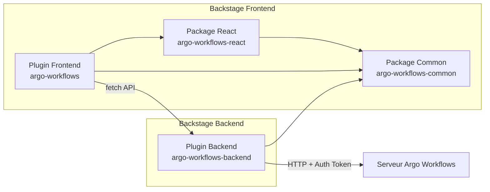
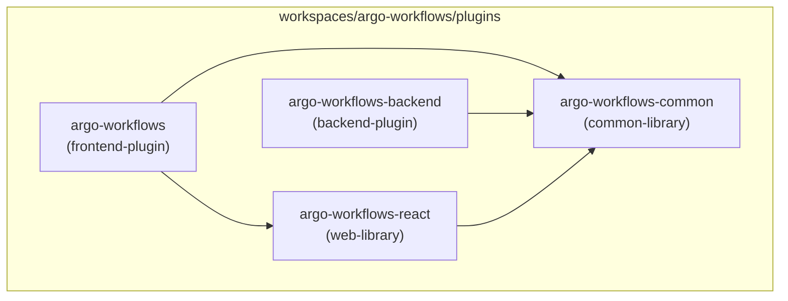
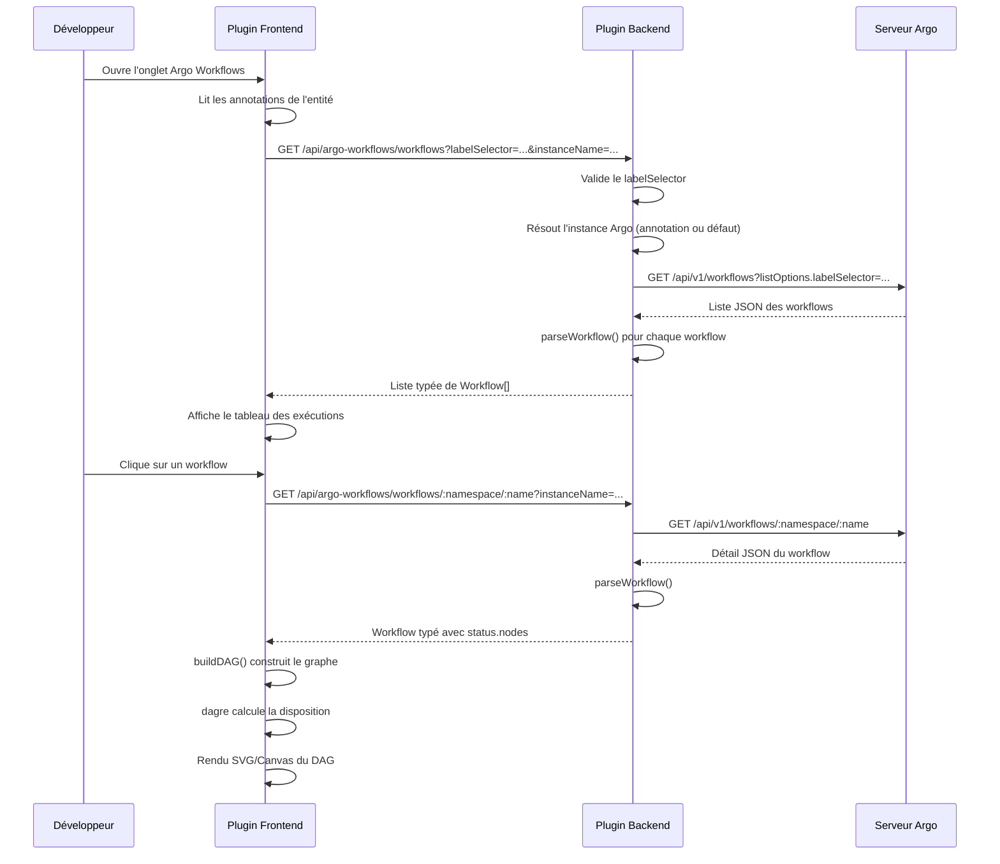

# Document de conception — Plugin Argo Workflows pour Backstage

## Vue d'ensemble

Ce document décrit la conception technique du plugin Backstage communautaire pour Argo Workflows. Le plugin suit la convention ADR011 de Backstage avec quatre packages (frontend, backend, common, react) et s'inspire de l'architecture du plugin Tekton communautaire.

Le plugin permet aux développeurs de :

- Visualiser la liste des exécutions de workflows Argo associées à un composant du catalogue Backstage
- Explorer le graphe DAG (Directed Acyclic Graph) interactif de chaque exécution
- Accéder aux données via un proxy backend sécurisé vers l'API Argo Workflows

Le backend sert de couche d'abstraction sécurisée entre le frontend Backstage et le serveur Argo Workflows, évitant l'exposition des credentials au navigateur.

## Architecture

### Vue d'ensemble de l'architecture



### Structure des packages (ADR011)



| Package                  | Rôle Backstage    | Nom npm                                              | Responsabilité                                             |
| ------------------------ | ----------------- | ---------------------------------------------------- | ---------------------------------------------------------- |
| `argo-workflows`         | `frontend-plugin` | `@backstage-community/plugin-argo-workflows`         | Plugin UI principal, onglet entité, routage                |
| `argo-workflows-backend` | `backend-plugin`  | `@backstage-community/plugin-argo-workflows-backend` | Proxy API, authentification Argo, routage REST             |
| `argo-workflows-common`  | `common-library`  | `@backstage-community/plugin-argo-workflows-common`  | Annotations, types partagés, fonctions de sérialisation    |
| `argo-workflows-react`   | `web-library`     | `@backstage-community/plugin-argo-workflows-react`   | Composants React réutilisables, hooks, construction du DAG |

### Flux de données



### Décisions de conception

1. **Proxy backend dédié vs proxy Backstage générique** : Un plugin backend dédié (comme ArgoCD) plutôt que le proxy générique de Backstage. Cela permet la validation des paramètres, la gestion multi-instances, et un meilleur contrôle des erreurs.

2. **dagre pour la disposition du DAG** : Bibliothèque éprouvée déjà utilisée par le plugin Tekton. Calcule automatiquement les positions des nœuds en respectant l'ordre topologique.

3. **@backstage/ui (BUI) pour les composants UI** : Le plugin utilise le design system officiel Backstage UI (`@backstage/ui`) pour tous les composants d'interface (layout avec `Flex`, `Box`, `Card`, `Grid` ; composants interactifs avec `Button`, `Text`, `Table`, `Tag`, `Tooltip`). BUI fournit des composants adaptatifs avec accessibilité intégrée, thème cohérent avec Backstage, et tokens CSS pour les styles personnalisés. Les icônes SVG de statut sont implémentées en tant que composants React personnalisés utilisant les tokens de couleur BUI (`--bui-*`).

4. **Package React séparé** : Permet à des plugins tiers de réutiliser les composants de visualisation (icônes de statut, construction du DAG) sans dépendre du plugin frontend complet.

5. **Sérialisation dans le package common** : Les fonctions `parseWorkflow` et `formatWorkflow` sont isomorphes (utilisables côté serveur et client), placées dans le package common pour être partagées.

## Composants et interfaces

### Package Common (`argo-workflows-common`)

```typescript
// annotations.ts
export const ARGO_WORKFLOWS_LABEL_SELECTOR_ANNOTATION =
  'argoworkflows.argoproj.io/workflow-selector';

export const ARGO_WORKFLOWS_INSTANCE_ANNOTATION =
  'argoworkflows.argoproj.io/instance-name';

// utils.ts
import { Entity } from '@backstage/catalog-model';

export function isArgoWorkflowsAvailable(entity: Entity): boolean;

// serialization.ts
export function parseWorkflow(raw: Record<string, unknown>): Workflow;
export function formatWorkflow(workflow: Workflow): Record<string, unknown>;
```

### Package React (`argo-workflows-react`)

```typescript
// components/WorkflowStatusIcon.tsx
export interface WorkflowStatusIconProps {
  status: WorkflowStatus;
  size?: 'small' | 'medium' | 'large';
}
export const WorkflowStatusIcon: React.FC<WorkflowStatusIconProps>;

// components/WorkflowStatusBadge.tsx
export interface WorkflowStatusBadgeProps {
  status: WorkflowStatus;
}
export const WorkflowStatusBadge: React.FC<WorkflowStatusBadgeProps>;

// hooks/useArgoWorkflows.ts
export function useArgoWorkflows(options: {
  labelSelector: string;
  instanceName?: string;
}): {
  workflows: Workflow[];
  loading: boolean;
  error: Error | undefined;
  retry: () => void;
};

// hooks/useArgoWorkflowDetail.ts
export function useArgoWorkflowDetail(options: {
  namespace: string;
  name: string;
  instanceName?: string;
}): {
  workflow: Workflow | undefined;
  loading: boolean;
  error: Error | undefined;
};

// utils/buildDAG.ts
export interface DAGNode {
  id: string;
  label: string;
  status: WorkflowStatus;
  startedAt?: string;
  finishedAt?: string;
  duration?: number;
  type: string;
}

export interface DAGEdge {
  source: string;
  target: string;
}

export interface DAGGraph {
  nodes: DAGNode[];
  edges: DAGEdge[];
}

export function buildDAG(workflow: Workflow): DAGGraph;
```

### Plugin Frontend (`argo-workflows`)

```typescript
// plugin.ts
import {
  createPlugin,
  createComponentExtension,
} from '@backstage/core-plugin-api';

export const argoWorkflowsPlugin = createPlugin({
  id: 'argo-workflows',
});

export const ArgoWorkflowsCI = argoWorkflowsPlugin.provide(
  createComponentExtension({
    name: 'ArgoWorkflowsCI',
    component: {
      lazy: () => import('./components/Router').then(m => m.Router),
    },
  }),
);

// components/Router.tsx
export const Router: React.FC;

// components/WorkflowRunsTable.tsx — Tableau des exécutions
// components/WorkflowDAGView.tsx — Visualisation du DAG
```

### Plugin Backend (`argo-workflows-backend`)

```typescript
// plugin.ts
import {
  createBackendPlugin,
  coreServices,
} from '@backstage/backend-plugin-api';

export const argoWorkflowsBackendPlugin = createBackendPlugin({
  pluginId: 'argo-workflows',
  register(env) {
    env.registerInit({
      deps: {
        config: coreServices.rootConfig,
        httpAuth: coreServices.httpAuth,
        httpRouter: coreServices.httpRouter,
        logger: coreServices.logger,
      },
      async init({ config, httpAuth, httpRouter, logger }) {
        httpRouter.use(await createRouter({ config, httpAuth, logger }));
      },
    });
  },
});

// router.ts
export async function createRouter(
  options: RouterOptions,
): Promise<express.Router>;

// service/ArgoWorkflowsService.ts
export class ArgoWorkflowsService {
  constructor(config: RootConfigService, logger: LoggerService);
  listWorkflows(
    instanceName: string,
    labelSelector: string,
  ): Promise<Workflow[]>;
  getWorkflow(
    instanceName: string,
    namespace: string,
    name: string,
  ): Promise<Workflow>;
}
```

### Configuration `app-config.yaml`

```yaml
argoWorkflows:
  defaultInstance: main
  instances:
    - name: main
      baseUrl: https://argo-workflows.example.com
      token: ${ARGO_WORKFLOWS_TOKEN}
    - name: staging
      baseUrl: https://argo-workflows-staging.example.com
      token: ${ARGO_WORKFLOWS_STAGING_TOKEN}
```

### Annotation d'entité catalogue

```yaml
apiVersion: backstage.io/v1alpha1
kind: Component
metadata:
  name: my-service
  annotations:
    argoworkflows.argoproj.io/workflow-selector: 'app=my-service'
    argoworkflows.argoproj.io/instance-name: main # optionnel
```

## Modèles de données

### Types TypeScript partagés (Package Common)

```typescript
/** Statut d'exécution d'un workflow ou d'un nœud */
export type WorkflowStatus =
  | 'Pending'
  | 'Running'
  | 'Succeeded'
  | 'Failed'
  | 'Error';

/** Métadonnées Kubernetes d'un workflow */
export interface WorkflowMetadata {
  name: string;
  namespace: string;
  uid: string;
  labels?: Record<string, string>;
  annotations?: Record<string, string>;
  creationTimestamp: string;
}

/** Nœud individuel dans le DAG d'un workflow */
export interface WorkflowNode {
  id: string;
  name: string;
  displayName: string;
  type: 'Pod' | 'Steps' | 'StepGroup' | 'DAG' | 'Retry' | 'Skipped' | 'Suspend';
  phase: WorkflowStatus;
  startedAt?: string;
  finishedAt?: string;
  children?: string[]; // IDs des nœuds enfants
  message?: string;
  templateName?: string;
}

/** Statut global d'un workflow */
export interface WorkflowStatusDetail {
  phase: WorkflowStatus;
  startedAt?: string;
  finishedAt?: string;
  nodes?: Record<string, WorkflowNode>;
  message?: string;
}

/** Modèle principal d'un workflow Argo */
export interface Workflow {
  metadata: WorkflowMetadata;
  status: WorkflowStatusDetail;
}

/** Réponse de la liste des workflows */
export interface WorkflowListResponse {
  workflows: Workflow[];
}
```

### Mapping des couleurs de statut

Les couleurs utilisent les tokens CSS de `@backstage/ui` (variables `--bui-*`) pour garantir la cohérence avec le thème Backstage et le support du mode sombre.

| WorkflowStatus | Couleur     | Token BUI CSS           | Icône SVG personnalisée |
| -------------- | ----------- | ----------------------- | ----------------------- |
| `Pending`      | Gris        | `--bui-color-neutral-7` | Hourglass               |
| `Running`      | Orange      | `--bui-color-warning-7` | Sync (animé)            |
| `Succeeded`    | Vert        | `--bui-color-success-7` | CheckCircle             |
| `Failed`       | Rouge       | `--bui-color-danger-7`  | XCircle                 |
| `Error`        | Rouge foncé | `--bui-color-danger-9`  | AlertTriangle           |

### Schéma de validation `parseWorkflow`

Champs obligatoires pour `parseWorkflow` :

- `metadata.name` (string)
- `metadata.namespace` (string)
- `status.phase` (WorkflowStatus)

Champs optionnels : tous les autres champs sont extraits s'ils sont présents, ignorés sinon. Les champs inconnus de la réponse JSON brute sont silencieusement ignorés.

## Propriétés de correction

_Une propriété est une caractéristique ou un comportement qui doit rester vrai pour toutes les exécutions valides d'un système — essentiellement, une déclaration formelle de ce que le système doit faire. Les propriétés servent de pont entre les spécifications lisibles par l'humain et les garanties de correction vérifiables par la machine._

### Propriété 1 : Disponibilité du plugin basée sur les annotations

_Pour toute_ entité du catalogue Backstage, `isArgoWorkflowsAvailable(entity)` retourne `true` si et seulement si l'annotation `argoworkflows.argoproj.io/workflow-selector` est présente et sa valeur est une chaîne non vide (après trim).

**Valide : Exigences 2.1, 2.2, 2.3**

### Propriété 2 : Round-trip de sérialisation des workflows

_Pour tout_ objet `Workflow` valide (éventuellement enrichi de champs inconnus dans la source JSON), l'application successive de `formatWorkflow` puis `parseWorkflow` produit un objet équivalent à l'objet initial. Les champs inconnus présents dans la source JSON sont ignorés sans erreur.

**Valide : Exigences 7.1, 7.2, 7.3, 7.4**

### Propriété 3 : Erreur descriptive pour champs obligatoires manquants

_Pour toute_ réponse JSON brute à laquelle il manque au moins un des champs obligatoires (`metadata.name`, `metadata.namespace`, `status.phase`), `parseWorkflow` lève une erreur dont le message contient le nom de chaque champ manquant.

**Valide : Exigence 7.5**

### Propriété 4 : Invariant du nombre de nœuds du DAG

_Pour tout_ objet `Workflow` valide contenant `status.nodes`, le graphe DAG produit par `buildDAG` contient exactement autant de nœuds que d'entrées dans `status.nodes`.

**Valide : Exigences 8.1, 8.3**

### Propriété 5 : Correspondance des arêtes du DAG avec les dépendances

_Pour tout_ objet `Workflow` valide, chaque relation parent→enfant déclarée dans le champ `children` d'un `WorkflowNode` correspond à exactement une arête orientée dans le graphe DAG produit par `buildDAG`, et le graphe ne contient aucune arête supplémentaire. Les nœuds qui ne sont enfants d'aucun autre nœud n'ont aucune arête entrante (nœuds racines).

**Valide : Exigences 8.2, 8.6**

### Propriété 6 : Détection de cycles dans le DAG

_Pour tout_ objet `Workflow` dont les relations `children` contiennent au moins un cycle, `buildDAG` lève une erreur descriptive indiquant la présence d'un cycle au lieu de produire un graphe invalide.

**Valide : Exigence 8.4**

### Propriété 7 : Validité topologique du DAG

_Pour tout_ graphe DAG construit par `buildDAG` à partir d'un `Workflow` valide (acyclique), un tri topologique du graphe est possible sans erreur.

**Valide : Exigence 8.5**

### Propriété 8 : Validation du sélecteur de labels Kubernetes

_Pour toute_ chaîne de caractères fournie comme `labelSelector`, le Plugin_Backend accepte la requête si et seulement si la chaîne est un sélecteur de labels Kubernetes valide (conforme à la syntaxe `key=value,key2=value2` ou `key in (v1,v2)`). Les chaînes invalides sont rejetées avec une erreur HTTP 400.

**Valide : Exigence 3.6**

### Propriété 9 : Tri des exécutions par date décroissante

_Pour toute_ liste de workflows retournée au frontend, les workflows sont triés par `status.startedAt` en ordre décroissant (le plus récent en premier).

**Valide : Exigence 4.7**

### Propriété 10 : Complétude et accessibilité de WorkflowStatusIcon

_Pour toute_ valeur valide de `WorkflowStatus` (`Pending`, `Running`, `Succeeded`, `Failed`, `Error`), le composant `WorkflowStatusIcon` retourne un élément React non nul possédant un attribut `aria-label` descriptif et non vide.

**Valide : Exigences 9.3, 9.4**

## Gestion des erreurs

### Erreurs backend

| Scénario                                           | Code HTTP    | Message                                                       | Action                                   |
| -------------------------------------------------- | ------------ | ------------------------------------------------------------- | ---------------------------------------- |
| Serveur Argo injoignable                           | 502          | "Le serveur Argo Workflows est indisponible"                  | Log l'erreur, retourne au frontend       |
| Erreur HTTP du serveur Argo                        | Code propagé | Message générique sans détails internes                       | Log les détails, retourne message filtré |
| Instance Argo inconnue                             | 404          | "Instance Argo Workflows '{name}' non trouvée"                | Retourne immédiatement                   |
| Aucune instance configurée                         | 503          | "Aucune instance Argo Workflows configurée"                   | Log un avertissement au démarrage        |
| labelSelector invalide                             | 400          | "Sélecteur de labels invalide : {détails}"                    | Rejet avant appel au serveur Argo        |
| Champs obligatoires manquants dans la réponse Argo | 502          | "Réponse invalide du serveur Argo : champs manquants {liste}" | Log l'erreur, retourne au frontend       |

### Erreurs frontend

| Scénario                 | Comportement UI                                                  |
| ------------------------ | ---------------------------------------------------------------- |
| Chargement en cours      | Affichage d'un skeleton/spinner                                  |
| Erreur réseau ou backend | Message d'erreur avec bouton "Réessayer"                         |
| Liste de workflows vide  | Message "Aucune exécution de workflow trouvée pour ce composant" |
| Workflow sans nœuds      | Message "Ce workflow ne contient pas de tâches" dans la vue DAG  |
| Annotation manquante     | L'onglet Argo Workflows est masqué (pas d'erreur visible)        |

### Stratégie de logging

- **Backend** : Utilisation du `LoggerService` de Backstage pour journaliser les erreurs de communication avec le serveur Argo, les erreurs de configuration, et les requêtes invalides.
- **Frontend** : Les erreurs sont capturées dans les hooks React et exposées via l'état `error` pour affichage dans l'UI.

## Stratégie de tests

### Approche duale : tests unitaires + tests par propriétés

Ce plugin utilise une approche de test combinée :

- **Tests unitaires (example-based)** : Vérifient des scénarios spécifiques, des cas limites et des conditions d'erreur
- **Tests par propriétés (property-based)** : Vérifient des propriétés universelles sur un large espace d'entrées générées aléatoirement

Les deux approches sont complémentaires : les tests unitaires détectent des bugs concrets, les tests par propriétés vérifient la correction générale.

### Bibliothèque de tests par propriétés

- **Bibliothèque** : [fast-check](https://github.com/dubzzz/fast-check) — bibliothèque PBT mature pour TypeScript/JavaScript
- **Configuration** : Minimum 100 itérations par test de propriété
- **Tag** : Chaque test de propriété inclut un commentaire référençant la propriété du document de conception
- **Format du tag** : `Feature: argo-workflows, Property {numéro}: {texte de la propriété}`

### Plan de tests par package

#### Package Common (`argo-workflows-common`)

**Tests par propriétés :**

- Propriété 1 : `isArgoWorkflowsAvailable` — Génère des entités aléatoires avec/sans annotation, vérifie le résultat booléen
- Propriété 2 : Round-trip `formatWorkflow`/`parseWorkflow` — Génère des objets Workflow aléatoires, vérifie l'identité après round-trip
- Propriété 3 : `parseWorkflow` avec champs manquants — Génère des JSON incomplets, vérifie le message d'erreur

**Tests unitaires :**

- Export des constantes d'annotations avec les bonnes valeurs
- Export des types TypeScript (vérification par compilation)

#### Package React (`argo-workflows-react`)

**Tests par propriétés :**

- Propriété 4 : Invariant du nombre de nœuds de `buildDAG`
- Propriété 5 : Correspondance arêtes/children de `buildDAG`
- Propriété 6 : Détection de cycles par `buildDAG`
- Propriété 7 : Validité topologique du DAG produit par `buildDAG`
- Propriété 10 : Complétude et accessibilité de `WorkflowStatusIcon`

**Tests unitaires :**

- Rendu de `WorkflowStatusIcon` pour chaque statut avec la bonne couleur
- Rendu de `WorkflowStatusBadge` avec icône et libellé
- Animation pour le statut `Running`
- Attributs `aria-label` pour l'accessibilité

#### Plugin Frontend (`argo-workflows`)

**Tests unitaires :**

- Enregistrement du plugin avec `createPlugin` et id `argo-workflows`
- Extension `ArgoWorkflowsCI` correctement fournie
- `Router` affiche le contenu quand l'annotation est présente
- `Router` retourne null quand l'annotation est absente
- `WorkflowRunsTable` affiche les colonnes attendues
- `WorkflowRunsTable` affiche le skeleton en chargement
- `WorkflowRunsTable` affiche le message d'erreur avec bouton réessayer
- `WorkflowRunsTable` affiche le message vide
- `WorkflowDAGView` affiche le graphe avec les nœuds colorés
- `WorkflowDAGView` affiche le tooltip au survol
- `WorkflowDAGView` affiche le message pour workflow sans nœuds
- Navigation du tableau vers la vue DAG au clic

**Tests par propriétés :**

- Propriété 9 : Tri des workflows par date décroissante

**Tests d'accessibilité :**

- Vérification axe-core sur les composants principaux
- Alternatives textuelles pour les indicateurs de statut
- Représentation textuelle alternative du DAG

#### Plugin Backend (`argo-workflows-backend`)

**Tests par propriétés :**

- Propriété 8 : Validation du labelSelector Kubernetes

**Tests d'intégration (supertest) :**

- `GET /api/argo-workflows/workflows` retourne la liste filtrée
- `GET /api/argo-workflows/workflows/:namespace/:name` retourne le détail
- Propagation des erreurs HTTP du serveur Argo
- Erreur 502 quand le serveur Argo est injoignable
- Erreur 404 pour instance inconnue
- Erreur 503 quand aucune instance n'est configurée
- Routage vers la bonne instance selon `instanceName`
- Utilisation de l'instance par défaut quand `instanceName` est absent

### Couverture des exigences par les tests

| Exigence               | Tests unitaires | Tests par propriétés     | Tests d'intégration |
| ---------------------- | --------------- | ------------------------ | ------------------- |
| 1 (Structure packages) | ✅ Smoke tests  | —                        | —                   |
| 2 (Annotations)        | ✅              | ✅ Propriété 1           | —                   |
| 3 (Proxy backend)      | ✅              | ✅ Propriété 8           | ✅                  |
| 4 (Liste exécutions)   | ✅              | ✅ Propriété 9           | —                   |
| 5 (Visualisation DAG)  | ✅              | —                        | —                   |
| 6 (Configuration)      | ✅              | —                        | ✅                  |
| 7 (Sérialisation)      | ✅              | ✅ Propriétés 2, 3       | —                   |
| 8 (Construction DAG)   | ✅              | ✅ Propriétés 4, 5, 6, 7 | —                   |
| 9 (Indicateurs statut) | ✅              | ✅ Propriété 10          | —                   |
| 10 (Accessibilité)     | ✅ axe-core     | —                        | —                   |
