# Design Document: Upstream Sync

## Overview

This design describes how to port upstream improvements from the `backstage/community-plugins` mcp-chat workspace into the fork's layered 13-package architecture. The fork diverged after a major structural refactor that split a monolithic 2-package plugin into dedicated common, node, provider module, backend, and frontend packages. The upstream continued evolving with error handling improvements, dependency bumps, and test coverage additions.

The sync focuses on:

1. Replacing plain `Error` throws with `ResponseError.fromResponse` in the `LLMProvider` base class and the OpenAI Responses provider module
2. Aligning third-party and Backstage framework dependency versions
3. Adding test files matching upstream coverage patterns
4. Verifying that existing frontend API client and alpha entry point already match upstream patterns

The guiding principle is **preserve the layered architecture boundaries**: changes to provider logic go in the node package or provider modules, contract types stay in the common package, and the backend plugin continues to export only its single `createBackendPlugin` entry.

## Architecture

The workspace has this dependency graph (arrows mean "depends on"):

```mermaid
graph TD
    FE["mcp-chat (frontend)"] --> COMMON["mcp-chat-common"]
    FE --> BSFrontendAPI["@backstage/frontend-plugin-api"]
    FE --> BSCoreAPI["@backstage/core-plugin-api"]
    FE --> BSErrors["@backstage/errors"]

    BE["mcp-chat-backend"] --> NODE["mcp-chat-node"]
    BE --> COMMON
    BE --> BSBackendAPI["@backstage/backend-plugin-api"]
    BE --> BSErrors
    BE --> MCP_SDK["@modelcontextprotocol/sdk"]
    BE --> Express["express"]

    NODE --> COMMON
    NODE --> BSBackendAPI
    NODE --> BSErrors

    MOD_GEMINI["module-gemini"] --> NODE
    MOD_GEMINI --> GoogleGenAI["@google/genai"]
    MOD_OLLAMA["module-ollama"] --> NODE
    MOD_OLLAMA --> OllamaSDK["ollama"]
    MOD_RESPONSES["module-openai-responses"] --> NODE
    MOD_OPENAI["module-openai"] --> NODE
    MOD_LITELLM["module-litellm"] --> NODE
    MOD_ANTHROPIC["module-anthropic"] --> NODE
    MOD_AZURE["module-azure-openai"] --> NODE
    MOD_BEDROCK["module-amazon-bedrock"] --> NODE
    MOD_AGW["module-agentgateway"] --> NODE
```



All provider modules depend on the node package for `LLMProvider` / `OpenAICompatibleBase`. The backend plugin depends on the node package for type imports only (it discovers providers at runtime via the extension point). The frontend is independent and communicates over HTTP.

## Components and Interfaces

### Component 1: ResponseError Integration in LLMProvider Base (Node Package)

**File:** `plugins/mcp-chat-node/src/LLMProvider.ts`

**Current state:** The `makeRequest` method throws `new Error(...)` with a string interpolation of status and body.

**Target state:** Replace with `throw await ResponseError.fromResponse(response)` from `@backstage/errors`. This preserves the HTTP status code, response headers, and body as structured metadata on the error object rather than flattening it into a string.

**Interface change:** None. The method signature remains `protected async makeRequest(endpoint: string, body: any): Promise<any>`. The thrown type changes from `Error` to `ResponseError` (which extends `Error`), so all existing `catch` blocks continue to work.

**Required dependency addition:** `@backstage/errors` added to `plugins/mcp-chat-node/package.json` dependencies.

**Implementation detail:**

```typescript
// Before
throw new Error(`Request failed with status ${response.status}: ${errorText}`);

// After
import { ResponseError } from '@backstage/errors';
// ...
throw await ResponseError.fromResponse(response);
```

Note: `ResponseError.fromResponse` is async because it reads the response body. Since the current code already reads the body via `response.text()` before throwing, this requires restructuring to pass the original `Response` object to `ResponseError.fromResponse` before consuming the body. However, the logging call uses `errorText` — so we must clone or re-read. The cleanest approach:

1. Remove the manual `response.text()` read
2. Clone the response for logging (or log the status only)
3. Pass the original response to `ResponseError.fromResponse`

Alternatively, since `ResponseError.fromResponse` internally reads the body, we can log the status code and let the ResponseError carry the body:

```typescript
if (!response.ok) {
  this.logger?.error(
    `[${this.type}] Request failed (${response.status}) after ${duration}ms`,
  );
  throw await ResponseError.fromResponse(response);
}
```

This is the approach upstream uses. The body detail is preserved in the `ResponseError` instance and available to callers, removing the need for inline logging of `errorText`.

### Component 2: ResponseError Integration in OpenAI Responses Module

**File:** `plugins/mcp-chat-backend-module-openai-responses/src/OpenAIResponsesProvider.ts`

**Current state:** The provider overrides `makeRequest` and throws `new Error(...)` on non-OK responses.

**Target state:** Replace with `throw await ResponseError.fromResponse(response)`. Since this module already depends on the node package (which will now have `@backstage/errors` as a dependency), the module can import `ResponseError` from `@backstage/errors` directly or re-export it from the node package.

**Decision:** Import `ResponseError` directly from `@backstage/errors` in the module. This avoids adding a re-export to the node package's public API, which would violate the minimal-surface-area principle. Add `@backstage/errors` as a direct dependency of the openai-responses module.

### Component 3: Frontend API Client (Verification Only)

**File:** `plugins/mcp-chat/src/api/McpChatApi.ts`

**Current state:** Already uses `throw await ResponseError.fromResponse(response)` consistently across all methods. `@backstage/errors` is already in the frontend package dependencies at `^1.3.0`.

**Action:** No code changes needed. Add a test asserting the ResponseError behavior if not already covered.

### Component 4: Frontend Alpha Entry Point (Verification Only)

**File:** `plugins/mcp-chat/src/alpha.tsx`

**Current state:** Already declares:

- `ApiBlueprint.make` with `discoveryApiRef` and `fetchApiRef` dependencies
- `PageBlueprint.make` with `path`, `title`, `icon` (JSX `<BotIconComponent />`), `loader`, and `routeRef`
- Default export via `createFrontendPlugin`

**Action:** No code changes needed. The existing `alpha.test.tsx` file should already cover this. Verify it does.

## Data Models

No data model changes are required. The `ResponseError` class is an existing Backstage framework type — it doesn't introduce new data structures to the workspace.

The only structural change is to the _thrown error type_ in `makeRequest`:

| Field         | Before                                  | After                                       |
| ------------- | --------------------------------------- | ------------------------------------------- |
| Error class   | `Error`                                 | `ResponseError` (extends `Error`)           |
| `.message`    | `"Request failed with status 401: ..."` | `"Request failed with status 401"`          |
| `.body`       | N/A                                     | `{ error: { ... } }` (parsed response body) |
| `.statusCode` | N/A                                     | `401`                                       |
| `.response`   | N/A                                     | Original HTTP response metadata             |

## Error Handling

### Error Propagation Chain

```
LLMProvider.makeRequest() throws ResponseError
  → OpenAICompatibleBase.sendMessage() propagates
    → QueryProcessor.processQuery() propagates
      → chatRoutes handler catches and re-throws
        → createErrorHandler middleware maps to HTTP status
```

The existing error handler middleware in `plugins/mcp-chat-backend/src/middleware/` already handles `ResponseError` (it extends the Backstage error hierarchy). No middleware changes required.

### Error Handling in OpenAI Responses Module

The `testConnection()` method in `OpenAIResponsesProvider` does NOT throw on non-OK responses — it returns `{ connected: false, error: string }`. This method must NOT be changed to use ResponseError since it handles errors gracefully by design.

Only the `makeRequest` override needs the ResponseError treatment.

## Testing Strategy

### Assessment: Property-Based Testing Applicability

PBT is **not applicable** for this feature. The changes are:

- Replacing error constructors (finite, deterministic behavior keyed on HTTP status codes)
- Version string bumps in JSON files (configuration, not logic)
- Adding test coverage for existing behavior (testing, not feature logic)

There is no pure function with a wide input space that would benefit from randomized testing here. The appropriate strategies are:

- **Example-based unit tests** for the ResponseError integration (test specific HTTP status codes: 400, 401, 403, 404, 429, 500)
- **Integration tests** for router coverage (supertest against Express)
- **Hook tests** for frontend (React Testing Library)

### Test File Placement (Layered Architecture)

| Test Target                                         | Package                 | File Path                                                                                       |
| --------------------------------------------------- | ----------------------- | ----------------------------------------------------------------------------------------------- |
| `LLMProvider.makeRequest` ResponseError             | mcp-chat-node           | `plugins/mcp-chat-node/src/LLMProvider.test.ts`                                                 |
| `OpenAICompatibleBase` (existing)                   | mcp-chat-node           | `plugins/mcp-chat-node/src/OpenAICompatibleBase.test.ts` (update)                               |
| `OpenAIResponsesProvider.makeRequest` ResponseError | module-openai-responses | `plugins/mcp-chat-backend-module-openai-responses/src/OpenAIResponsesProvider.test.ts` (update) |
| Router integration                                  | mcp-chat-backend        | `plugins/mcp-chat-backend/src/router.test.ts` (already comprehensive)                           |
| `SummarizationService` edge cases                   | mcp-chat-backend        | `plugins/mcp-chat-backend/src/services/SummarizationService.test.ts` (update)                   |
| `useConversations` hook                             | mcp-chat                | `plugins/mcp-chat/src/hooks/useConversations.test.tsx` (new)                                    |

### Test Design Details

**LLMProvider.test.ts (new file):**

- Create a concrete test subclass (since LLMProvider is abstract)
- Mock `global.fetch` to return non-OK responses
- Assert that `makeRequest` throws a `ResponseError` instance
- Assert that the ResponseError carries the correct status code
- Test with status codes 400, 401, 500
- Test the happy path: mock 200 response, verify JSON parsing

**OpenAICompatibleBase.test.ts (update):**

- Add test for `testConnection()` with HTTP 401, 403, 404, 429 status codes
- Verify error messages map correctly per the `mapConnectionError` method
- These tests complement the existing Property 4 and Property 5 tests

**useConversations.test.tsx (new file):**

- Test guest user exclusion (when auth returns a guest principal, conversations are not fetched)
- Test optimistic delete: verify UI updates before server responds, then rolls back on error
- Test optimistic star toggle: verify toggle renders immediately, rolls back on error
- Use `@testing-library/react` with `renderHook` and `@backstage/test-utils` mock APIs

### Existing Coverage Already Sufficient

The following areas in the requirements are already covered by existing tests:

- **Router integration (Requirement 5):** `router.test.ts` already has 30+ test cases covering all routes including GET/POST/PATCH/DELETE for conversations, status, tools, and chat
- **SummarizationService (Requirement 4.3):** `SummarizationService.test.ts` already exists with timeout, disabled, and sanitization coverage
- **Frontend alpha (Requirement 7):** `alpha.test.tsx` already exists
- **Frontend API client ResponseError (Requirement 6):** The API client already uses ResponseError; a targeted test for the error behavior should be added to the API test file

### Dependency Version Bump Strategy

| Package                 | Dependency                       | Current       | Target    | Reason                           |
| ----------------------- | -------------------------------- | ------------- | --------- | -------------------------------- |
| mcp-chat-node           | `@backstage/errors`              | (not present) | `^1.2.7`  | New dependency for ResponseError |
| mcp-chat-node           | `@backstage/backend-plugin-api`  | `^1.4.0`      | `^1.8.0`  | Align with upstream              |
| mcp-chat-backend        | `@backstage/backend-plugin-api`  | `^1.4.0`      | `^1.8.0`  | Align with upstream              |
| mcp-chat-backend        | `@modelcontextprotocol/sdk`      | `^1.25.2`     | `^1.25.2` | Already aligned                  |
| mcp-chat-backend        | `express`                        | `^4.22.0`     | `^4.22.0` | Already aligned                  |
| mcp-chat                | `@backstage/frontend-plugin-api` | `^0.16.2`     | `^0.16.2` | Already exceeds `^0.15.1`        |
| mcp-chat                | `@backstage/core-plugin-api`     | `^1.12.5`     | `^1.12.5` | Already exceeds `^1.12.4`        |
| module-gemini           | `@google/genai`                  | `^1.41.0`     | `^1.41.0` | Already aligned                  |
| module-ollama           | `ollama`                         | `^0.6.0`      | `^0.6.0`  | Already aligned                  |
| module-openai-responses | `@backstage/errors`              | (not present) | `^1.2.7`  | New dependency for ResponseError |

**Key finding:** Most dependency versions are already aligned. The only actual bumps needed are:

1. Add `@backstage/errors` to `mcp-chat-node` dependencies
2. Add `@backstage/errors` to `mcp-chat-backend-module-openai-responses` dependencies
3. Bump `@backstage/backend-plugin-api` from `^1.4.0` to `^1.8.0` in both `mcp-chat-node` and `mcp-chat-backend`

### Backstage Framework Version Alignment

| Package          | Field                            | Current   | Target    | Status                 |
| ---------------- | -------------------------------- | --------- | --------- | ---------------------- |
| mcp-chat-backend | `backstage.supported-versions`   | `1.40.0`  | `1.40.0`  | Already aligned        |
| mcp-chat         | `backstage.supported-versions`   | `1.40.0`  | `1.40.0`  | Already aligned        |
| mcp-chat-backend | `@backstage/backend-plugin-api`  | `^1.4.0`  | `^1.8.0`  | Needs bump             |
| mcp-chat         | `@backstage/frontend-plugin-api` | `^0.16.2` | `^0.16.2` | Already exceeds target |
| mcp-chat         | `@backstage/core-plugin-api`     | `^1.12.5` | `^1.12.5` | Already exceeds target |

### Build Order / Sequencing

To keep `yarn tsc:full` green throughout, changes must be applied in dependency order:


**Rationale:**

1. **Package.json first** — resolving dependencies before changing source ensures imports resolve
2. **Node package before modules** — modules import from the node package, so its API must be stable first
3. **Source before tests** — tests import from source; source must compile first
4. **tsc:full before test** — catch type errors before running Jest
5. **API reports last** — captures the final public API surface after all changes

### Sequencing Detail

Within Step 1, the package.json edits are safe to parallelize since they don't affect each other's compilation. The `yarn install` in Step 2 resolves all lockfile changes in one pass.

Steps 3-4 are the only source-breaking changes. They must succeed at `tsc:full` before proceeding. If `@backstage/errors` is already resolved in `node_modules` (via the backend plugin's existing dependency), the node package can import it even before `yarn install` — but we run install first for correctness.

## Summary of Actions

| #   | Action                                                                                                  | Package                 | Files                             |
| --- | ------------------------------------------------------------------------------------------------------- | ----------------------- | --------------------------------- |
| 1   | Add `@backstage/errors: ^1.2.7` to dependencies                                                         | mcp-chat-node           | `package.json`                    |
| 2   | Bump `@backstage/backend-plugin-api` to `^1.8.0`                                                        | mcp-chat-node           | `package.json`                    |
| 3   | Bump `@backstage/backend-plugin-api` to `^1.8.0`                                                        | mcp-chat-backend        | `package.json`                    |
| 4   | Add `@backstage/errors: ^1.2.7` to dependencies                                                         | module-openai-responses | `package.json`                    |
| 5   | Run `yarn install`                                                                                      | workspace root          | `yarn.lock`                       |
| 6   | Replace `throw new Error(...)` with `throw await ResponseError.fromResponse(response)`                  | mcp-chat-node           | `LLMProvider.ts`                  |
| 7   | Replace `throw new Error(...)` with `throw await ResponseError.fromResponse(response)` in `makeRequest` | module-openai-responses | `OpenAIResponsesProvider.ts`      |
| 8   | Create `LLMProvider.test.ts`                                                                            | mcp-chat-node           | `LLMProvider.test.ts`             |
| 9   | Add `testConnection` error mapping tests                                                                | mcp-chat-node           | `OpenAICompatibleBase.test.ts`    |
| 10  | Update test to assert `ResponseError` in `makeRequest`                                                  | module-openai-responses | `OpenAIResponsesProvider.test.ts` |
| 11  | Create `useConversations.test.tsx`                                                                      | mcp-chat                | `hooks/useConversations.test.tsx` |
| 12  | Run verification pipeline                                                                               | workspace               | —                                 |
