# Diagramme des Pipelines CI/CD

## Vue d'ensemble

Ce dépôt utilise GitHub Actions avec 12 workflows organisés en 5 catégories : intégration continue, release, automatisation des PRs, sécurité et maintenance.

```mermaid
graph TB
    subgraph "Déclencheurs"
        PR["Pull Request"]
        PUSH["Push sur main"]
        CRON_TRIGGER["Planification (cron)"]
        MANUAL["Déclenchement manuel"]
        PR_TARGET["pull_request_target"]
        COMMENT["Commentaire sur issue/PR"]
    end

    subgraph "Intégration Continue"
        CI["CI<br/><i>ci.yml</i>"]
        CI_DETECT["Detect workspace changes"]
        CI_JOB["CI step<br/>(Node 22.x, 24.x)"]
        CI_VERIFY["Verify step"]
        CI_RESULT["Check all required jobs"]

        CI --> CI_DETECT
        CI_DETECT --> CI_JOB
        CI_DETECT --> CI_VERIFY
        CI_JOB --> CI_RESULT
        CI_VERIFY --> CI_RESULT
    end

    subgraph "CI Steps Detail"
        direction LR
        INSTALL_CI["yarn install"]
        FIX_CHECK["repo fix --check"]
        CONFIG_CHECK["config:check"]
        TSC["tsc"]
        PRETTIER["prettier:check"]
        API_REPORTS["build:api-reports"]
        BUILD_ALL["build --all"]
        LINT["lint"]
        PUBLISH_CHECK["fix --check --publish"]
        TEST["test --coverage"]
        CLEAN_CHECK["ensure clean working dir"]

        INSTALL_CI --> FIX_CHECK --> CONFIG_CHECK --> TSC --> PRETTIER --> API_REPORTS --> BUILD_ALL --> LINT --> PUBLISH_CHECK --> TEST --> CLEAN_CHECK
    end

    subgraph "Release"
        RELEASE["Release all workspaces<br/><i>release.yml</i>"]
        RELEASE_DETECT["Detect workspace changes"]
        RELEASE_WS["Release workspace<br/><i>release_workspace.yml</i>"]
        CHANGESETS_PR["Update Version<br/>Packages PR"]
        RELEASE_PUBLISH["Release & Publish<br/>to npm"]

        RELEASE --> RELEASE_DETECT
        RELEASE_DETECT -->|"pour chaque workspace modifié"| RELEASE_WS
        RELEASE_WS --> CHANGESETS_PR
        CHANGESETS_PR -->|"needs_release == true"| RELEASE_PUBLISH
    end

    subgraph "Release Steps Detail"
        direction LR
        INSTALL_REL["yarn install"]
        TSC_REL["tsc"]
        BUILD_REL["build:all"]
        NPM_PUBLISH["npm publish"]
        CREATE_TAG["create tag"]

        INSTALL_REL --> TSC_REL --> BUILD_REL --> NPM_PUBLISH --> CREATE_TAG
    end

    subgraph "Version Bump"
        VBUMP["Version Bump<br/><i>version-bump.yml</i>"]
        VBUMP_INSTALL["yarn install"]
        VBUMP_CMD["backstage-cli<br/>versions:bump"]
        VBUMP_DEDUPE["yarn dedupe"]
        VBUMP_CHANGESET["Ajout changeset"]
        VBUMP_PR["Création PR"]

        VBUMP --> VBUMP_INSTALL --> VBUMP_CMD --> VBUMP_DEDUPE --> VBUMP_CHANGESET --> VBUMP_PR
    end

    subgraph "Automatisation des PRs"
        PR_SYNC["PR Sync<br/><i>pr.yml</i>"]
        CHANGESET_FB["Changeset Feedback<br/><i>automate_changeset_feedback.yml</i>"]
        RENOVATE_CS["Renovate Changeset<br/><i>automate_renovate_changeset.yml</i>"]
    end

    subgraph "Sécurité & Qualité"
        CODEQL["CodeQL Analysis<br/><i>codeql.yml</i>"]
        SCORECARD["Scorecard<br/><i>scorecard.yml</i>"]
    end

    subgraph "Maintenance"
        CRON_WF["Cron<br/><i>cron.yml</i>"]
        STALE["Automate Staleness<br/><i>automate-staleness.yml</i>"]
        RENOVATE["Renovate<br/><i>renovate.yaml</i>"]
    end

    %% Connexions déclencheurs → workflows
    PR --> CI
    PR --> CODEQL
    PR_TARGET --> PR_SYNC
    PR_TARGET --> CHANGESET_FB
    PR_TARGET --> RENOVATE_CS
    COMMENT --> PR_SYNC
    PUSH --> RELEASE
    PUSH --> CODEQL
    PUSH --> SCORECARD
    CRON_TRIGGER --> STALE
    CRON_TRIGGER --> CRON_WF
    CRON_TRIGGER --> RENOVATE
    CRON_TRIGGER --> CODEQL
    MANUAL --> RELEASE_WS
    MANUAL --> VBUMP
    MANUAL --> STALE
    MANUAL --> RENOVATE
```

## Détail des workflows

### 1. CI (`ci.yml`)

| Propriété   | Valeur                                                 |
| ----------- | ------------------------------------------------------ |
| Déclencheur | `pull_request`                                         |
| Concurrence | Par workflow + ref (annule les exécutions précédentes) |

**Jobs :**

| Job                       | Dépendances               | Description                                                           |
| ------------------------- | ------------------------- | --------------------------------------------------------------------- |
| `find-changed-workspaces` | —                         | Détecte les workspaces modifiés via `list-workspaces-with-changes.js` |
| `ci`                      | `find-changed-workspaces` | Exécute la matrice CI (Node 22.x, 24.x) par workspace modifié         |
| `verify`                  | `find-changed-workspaces` | Vérifie les doublons dans le lockfile et les changesets               |
| `result`                  | `ci`, `verify`            | Gate finale : échoue si un job requis a échoué, été annulé ou ignoré  |

**Étapes CI par workspace :**
`yarn install` → `fix --check` → `config:check` → `tsc` → `prettier:check` → `build:api-reports` → `build --all` → `lint` → `test --coverage` → `ensure clean working directory`

---

### 2. Release all workspaces (`release.yml`)

| Propriété   | Valeur                                                   |
| ----------- | -------------------------------------------------------- |
| Déclencheur | `push` sur `main`, `workflow_dispatch`                   |
| Permissions | `read-all` (défaut), `contents: write` pour la détection |

**Jobs :**

| Job                       | Dépendances               | Description                                                   |
| ------------------------- | ------------------------- | ------------------------------------------------------------- |
| `find-changed-workspaces` | —                         | Détecte les workspaces modifiés depuis le commit précédent    |
| `maybe-release-workspace` | `find-changed-workspaces` | Appelle `release_workspace.yml` pour chaque workspace modifié |

---

### 3. Release workspace (`release_workspace.yml`)

| Propriété   | Valeur                                 |
| ----------- | -------------------------------------- |
| Déclencheur | `workflow_dispatch`, `workflow_call`   |
| Paramètres  | `workspace`, `force_release`, `branch` |
| Concurrence | Par workflow + workspace               |

**Jobs :**

| Job             | Dépendances     | Description                                                              |
| --------------- | --------------- | ------------------------------------------------------------------------ |
| `changesets-pr` | —               | Vérifie si une release est nécessaire, met à jour la PR Version Packages |
| `release`       | `changesets-pr` | Compile, build, publie sur npm et crée un tag git                        |

---

### 4. Version Bump (`version-bump.yml`)

| Propriété   | Valeur                                                                                              |
| ----------- | --------------------------------------------------------------------------------------------------- |
| Déclencheur | `workflow_dispatch`                                                                                 |
| Paramètres  | `release_line` (next/main), `workspace_input` (JSON array), `version-bump-type` (major/minor/patch) |

Exécute `backstage-cli versions:bump` par workspace, crée une branche, un changeset et ouvre une PR.

---

### 5. PR Sync (`pr.yml`)

| Propriété   | Valeur                                                                                |
| ----------- | ------------------------------------------------------------------------------------- |
| Déclencheur | `pull_request_target` (opened/synchronize/reopened/closed), `issue_comment` (created) |

Synchronise les labels et assignations via `backstage/actions/pr-sync`.

---

### 6. Changeset Feedback (`automate_changeset_feedback.yml`)

| Propriété   | Valeur                           |
| ----------- | -------------------------------- |
| Déclencheur | `pull_request_target` sur `main` |

Génère un commentaire de feedback sur les changesets manquants ou présents dans la PR.

---

### 7. Renovate Changeset (`automate_renovate_changeset.yml`)

| Propriété   | Valeur                                                |
| ----------- | ----------------------------------------------------- |
| Déclencheur | `pull_request_target` (modifications sur `yarn.lock`) |
| Condition   | Uniquement pour l'acteur `backstage-goalie[bot]`      |

Génère automatiquement des changesets pour les PRs Renovate.

---

### 8. CodeQL (`codeql.yml`)

| Propriété   | Valeur                                                                        |
| ----------- | ----------------------------------------------------------------------------- |
| Déclencheur | `push` sur `main`, `pull_request` sur `main`, cron hebdomadaire (lundi 00:00) |
| Langages    | JavaScript, TypeScript                                                        |

Analyse de sécurité statique via GitHub CodeQL.

---

### 9. Scorecard (`scorecard.yml`)

| Propriété   | Valeur                                                                        |
| ----------- | ----------------------------------------------------------------------------- |
| Déclencheur | `push` sur `main`, `branch_protection_rule`, cron hebdomadaire (samedi 12:21) |

Analyse de sécurité de la chaîne d'approvisionnement via OSSF Scorecard.

---

### 10. Cron (`cron.yml`)

| Propriété   | Valeur                                         |
| ----------- | ---------------------------------------------- |
| Déclencheur | `workflow_dispatch`, cron toutes les 5 minutes |

Exécute les tâches planifiées via `backstage/actions/cron`.

---

### 11. Staleness (`automate-staleness.yml`)

| Propriété   | Valeur                                        |
| ----------- | --------------------------------------------- |
| Déclencheur | `workflow_dispatch`, cron toutes les 6 heures |

Marque les issues inactives depuis 60 jours et les PRs inactives depuis 14 jours comme `stale`, puis les ferme après 7 jours supplémentaires.

---

### 12. Renovate (`renovate.yaml`)

| Propriété   | Valeur                                      |
| ----------- | ------------------------------------------- |
| Déclencheur | `workflow_dispatch`, cron toutes les heures |

Exécute Renovate Bot pour la mise à jour automatique des dépendances avec cache persistant entre les exécutions.
