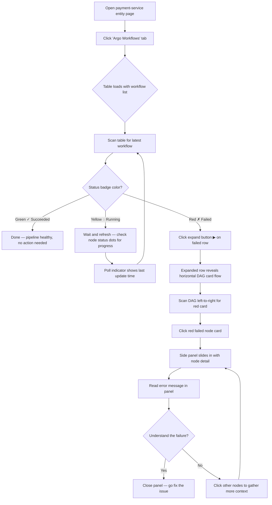
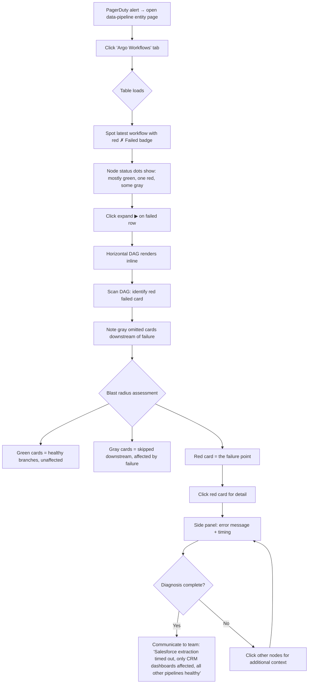
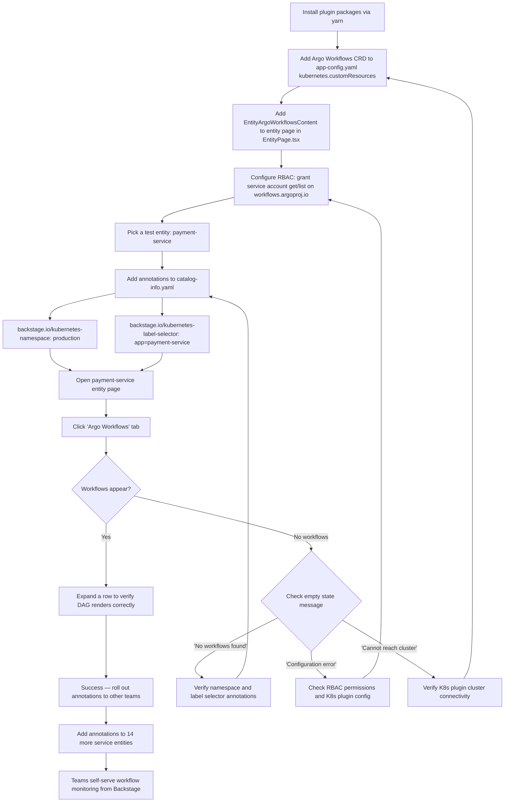

# UX Design Specification — Argo Workflows Plugin for Backstage

**Author:** Fjudith
**Date:** 2026-04-18

---

<!-- UX design content will be appended sequentially through collaborative workflow steps -->

## Executive Summary

### Project Vision

The Argo Workflows plugin for Backstage brings workflow execution observability directly into the Backstage service catalog, eliminating the context-switch to the Argo Workflows UI. Its centerpiece is an interactive DAG execution diagram — a first for the Backstage ecosystem. Unlike existing CI/CD plugins (Tekton, CodePipeline, CodeBuild) that render pipelines as flat tables or linear step lists, this plugin renders the actual workflow topology as an interactive graph, making parallel branches, dependencies, failure points, and blast radius immediately visible.

The plugin is built BUI-first using Backstage's native design tokens for automatic dark mode support and visual consistency. It integrates via the Backstage Kubernetes proxy by default, requiring no additional infrastructure beyond what's already configured for the Backstage K8s plugin.

### Target Users

**Priya — Service Owner (Primary)**
Backend engineer who owns services in the Backstage catalog. Uses Argo Workflows for CI/CD pipelines. Needs to monitor workflow execution status, identify failures, and understand what went wrong — all without leaving the developer portal. Values quick status glances and clear failure context.

**Marcus — Platform Engineer (Primary)**
Manages the Backstage instance and Argo Workflows infrastructure for 15+ service teams. Needs to give teams self-service workflow visibility without granting direct access to the Argo UI or kubectl. Values easy setup via entity annotations and broad team adoption.

**Kenji — SRE (Secondary)**
On-call responder who needs to diagnose workflow failures fast during incidents. The DAG topology is critical for understanding blast radius — which branches failed, which downstream nodes were affected, and which parts of the pipeline are healthy. Values speed, clarity, and precise diagnostic information.

**Aisha — Plugin Integrator (Future/Phase 2+)**
Builds custom Backstage plugins and wants reusable React hooks and components to embed Argo Workflows data in other views. Values typed APIs, composable hooks, and clean package boundaries.

### Key Design Challenges

1. **DAG complexity at scale** — Workflows can have 50–100+ nodes with parallel branches, nested DAGs, and retry logic. The diagram must remain legible and navigable without overwhelming users. Zoom, pan, minimap, and fit-to-view controls are essential, but layout quality from elkjs is the real differentiator.

2. **Information density balance** — Service owners want a quick "is it green?" status glance. SREs want deep diagnostic detail (which node failed, when, why, what's downstream). The UI must serve both use cases without cluttering either experience. Progressive disclosure (list → detail → DAG → node panel) is the key pattern.

3. **Backstage visual integration** — The DAG diagram is a custom visualization (React Flow) that must feel native to Backstage. BUI design tokens for colors, typography, spacing, and surface layering must be applied to custom graph nodes so the diagram doesn't look like an embedded foreign widget.

4. **Accessible status communication** — Seven workflow phases mapped to status colors. Accessibility requires status to be communicated through more than color alone — icons, shapes, or text labels must supplement color for color-blind users. BUI components inherit built-in accessibility, but custom DAG nodes need explicit attention.

### Design Opportunities

1. **Blast radius visibility** — The DAG topology makes it immediately clear which downstream nodes are affected by a failure — something impossible in flat table views. This is a genuine UX innovation for Backstage CI/CD plugins and the plugin's strongest differentiator.

2. **Progressive disclosure drill-down** — List → Detail → DAG → Node panel creates a natural information hierarchy that serves both quick-glance and deep-dive use cases elegantly. Each level adds detail without forcing it on users who don't need it.

3. **BUI-native graph rendering as a reusable pattern** — If the DAG visualization is done well with BUI tokens and custom React Flow nodes, it becomes a reference implementation for any Backstage plugin needing graph visualization. Sets a visual standard for the ecosystem.

## Core User Experience

### Defining Experience

The core user action is **checking workflow execution status from the Backstage entity page** — the list → detail → DAG drill-down flow. This is what users will do most frequently and what must feel completely natural.

The critical interaction to get right is the **DAG execution diagram**. It's the plugin's differentiator and the reason users would choose this over switching to the Argo UI. If the DAG is legible, fast, and makes failure diagnosis obvious at a glance, the plugin delivers on its promise. Everything else (workflow list, node panel, filtering) supports this core experience.

### Platform Strategy

- **Platform:** Web application — Backstage SPA plugin rendered as an entity page tab
- **Input:** Mouse and keyboard primary. No touch optimization required.
- **Offline:** Not applicable — Backstage is an always-connected developer portal
- **Platform constraint:** All UI must conform to the Backstage UI (BUI) design system. The plugin lives inside the Backstage shell and must respect its layout, navigation, and theming conventions.
- **Rendering environment:** React Flow canvas embedded within a BUI layout container. The DAG diagram is a custom visualization that must coexist with standard BUI components (tables, cards, badges) on the same page.

### Effortless Interactions

1. **Instant status recognition** — Opening the Argo Workflows tab shows a workflow list with clear status badges. "Is my workflow healthy?" is answered in under 1 second without any clicks.
2. **Failure location in the DAG** — Clicking into a failed workflow renders the DAG with the failed node visually prominent (red). No hunting, no scrolling through logs. The failure is spatially obvious.
3. **Blast radius understanding** — Downstream nodes affected by a failure are visually distinct (gray/dimmed for Omitted/Skipped). The user sees what broke and what was never reached in a single glance.
4. **Large workflow navigation** — Workflows with 50+ nodes render with a clean elkjs layout. Zoom, pan, fit-to-view, and minimap controls let users navigate without losing orientation. The minimap always shows the full picture.
5. **Node detail on demand** — Click any node in the DAG to see its detail panel (phase, type, timing, error message). No page navigation — the panel appears in context alongside the diagram.

### Critical Success Moments

1. **First load success** — User opens the Argo Workflows tab and sees their workflows listed with clear status badges. "It just works." No configuration errors, no empty states without guidance.
2. **10-second failure diagnosis** — User clicks a failed workflow → DAG renders → red node is immediately visible → click node → error message displayed. Total time from entity page to diagnosis: under 10 seconds.
3. **Incident blast radius clarity** — During an incident, the SRE sees the DAG and can instantly communicate: "Only the Salesforce branch failed, everything else is green." The topology tells the story without requiring log analysis.
4. **Smooth large workflow experience** — A 50-node workflow renders cleanly within 1 second. The layout is readable, the minimap provides overview, and zoom/pan feels responsive. The user never feels lost.

### Experience Principles

1. **Status at a glance** — Every view level (list, detail, DAG, node) communicates status immediately through color, icon, and text. No interpretation required. A user should know the health of their workflow within 1 second of looking at any screen.

2. **Topology tells the story** — The DAG shape itself is information. Parallel branches, dependencies, and failure cascades are visible from the graph structure, not buried in metadata tables. The visual layout communicates what happened and why.

3. **Progressive depth, not progressive complexity** — Each drill-down level adds detail without adding cognitive load. The list is simple (status + timing). The DAG is rich but focused (topology + phase colors). The node panel is detailed but scoped (one node's full context). Users choose their depth.

4. **Native, not embedded** — The plugin feels like it was always part of Backstage. BUI design tokens, consistent component patterns, automatic dark mode, and no visual seams between the plugin and the rest of the developer portal. The DAG diagram is custom but visually indistinguishable from a native Backstage component.

## Desired Emotional Response

### Primary Emotional Goals

1. **Confident and in control** — Users feel they have complete visibility into their workflow executions. No guessing, no ambiguity, no need to switch tools or ask someone else. The plugin gives them ownership of their workflow observability.

2. **Efficient and focused** — Users get the answer they need fast. The interaction is frictionless — status at a glance from the list, spatial understanding from the DAG, precise detail from the node panel. No wasted clicks, no dead ends.

3. **Calm during pressure** — During incidents and on-call situations, the plugin reduces anxiety rather than adding to it. The DAG topology provides clarity under stress — the visual structure tells the story without requiring the user to piece together information from logs or CLI output.

### Emotional Journey Mapping

| Stage | Desired Emotion | Design Implication |
|-------|----------------|-------------------|
| **First discovery** (opening the tab) | Reassurance — "This works, my workflows are here" | Clean workflow list with immediate status badges. No empty confusion. |
| **Routine check** (daily monitoring) | Efficiency — "Quick glance, all green, moving on" | Status badges and color coding answer the question before the user even clicks. |
| **Failure investigation** (clicking into a failed workflow) | Clarity — "I can see exactly where it broke" | DAG renders with failed node visually prominent. Spatial layout makes the failure location obvious. |
| **Deep diagnosis** (inspecting a node) | Competence — "I have all the information I need" | Node detail panel shows phase, timing, error message. No need to leave Backstage. |
| **Incident response** (2 AM on-call) | Calm focus — "I know the blast radius, I can communicate clearly" | DAG topology shows affected vs. healthy branches. Omitted/Skipped nodes are visually distinct from failures. |
| **Return visit** (coming back tomorrow) | Familiarity — "I know exactly where to look" | Consistent layout, predictable navigation, same patterns every time. |

### Micro-Emotions

**Prioritized emotional states:**

- **Confidence over confusion** — Every element communicates clearly. Status colors, node shapes, and labels all reinforce the same message. No ambiguous states.
- **Trust over skepticism** — Data is accurate and current. Polling indicators show when data was last refreshed. Error states are honest and actionable ("Can't reach cluster" not "Something went wrong").
- **Accomplishment over frustration** — The user finds what they need on the first try. The DAG layout is readable without manual rearrangement. Zoom and pan feel natural.

**Emotions to actively avoid:**

- **Overwhelm** — Large workflows must not feel chaotic. The elkjs layout, minimap, and fit-to-view controls prevent the "wall of nodes" feeling.
- **Distrust** — Stale data or unclear loading states erode confidence. Polling status and loading indicators must be visible.
- **Disorientation** — Navigating between list, detail, and DAG must feel like a natural drill-down, not a context switch. Breadcrumb-style navigation and consistent layout anchor the user.

### Design Implications

| Emotional Goal | UX Design Approach |
|---------------|-------------------|
| Confident and in control | Status badges on every workflow row. Phase colors on every DAG node. No ambiguous "unknown" states without explanation. |
| Efficient and focused | Workflow list answers "is it healthy?" without clicking. DAG answers "where did it fail?" without scrolling. Node panel answers "why did it fail?" without leaving the page. |
| Calm during pressure | High-contrast status colors that work under stress. Clear visual distinction between "failed" (red), "affected downstream" (gray), and "healthy" (green). No visual noise competing for attention. |
| Trust | Visible polling indicator ("Last updated 5s ago"). Honest error messages with actionable guidance. Loading skeletons instead of blank screens. |
| Familiarity on return | Consistent layout across all workflows. Same navigation pattern every time. No layout shifts or surprising UI changes between visits. |

### Emotional Design Principles

1. **Clarity is kindness** — Under stress, clear information reduces anxiety. Every design decision should prioritize unambiguous communication over aesthetic flourish.

2. **Speed builds trust** — Fast rendering (list < 2s, DAG < 1s) isn't just a performance metric — it's an emotional signal that the tool is reliable and responsive.

3. **The graph is the comfort** — The DAG topology itself is the primary anxiety-reducer during incidents. Seeing the shape of the workflow — what's green, what's red, what's gray — provides the situational awareness that calms an on-call engineer.

4. **Honest, not optimistic** — Error states, empty states, and loading states must be truthful. "No workflows found — check your entity annotations" is better than a spinner that never resolves. Users trust tools that tell them what's actually happening.

## UX Pattern Analysis & Inspiration

### Inspiring Products Analysis

**1. Argo Workflows UI**

The native Argo UI is the direct competitor experience — what users currently switch to from Backstage. Its DAG view renders the full workflow topology with status-colored nodes, click-to-inspect detail panels, and log streaming. What it does well: the DAG is the primary view (not an afterthought), node status is communicated through color and icon, and the topology is immediately legible for medium-sized workflows. What it struggles with: it's a standalone app requiring a separate URL and authentication context, the UI is not visually integrated with any developer portal, and large workflows (100+ nodes) can feel cluttered without strong layout algorithms. The key lesson: the DAG-first approach is validated — users expect to see topology, not just tables.

**2. GitHub Actions**

GitHub Actions provides a workflow run visualization that millions of developers use daily. Its strengths: the left sidebar shows a step-by-step tree with status icons (green checkmark, red X, yellow spinner) that communicates status at a glance. Clicking a step expands its logs inline. The overall pattern is progressive disclosure — summary → step list → log detail. What's relevant: the status icon vocabulary is universally understood by developers. The "click to expand" pattern for detail is low-friction. The weakness: GitHub Actions renders workflows as a linear list of jobs/steps, not a DAG. Parallel jobs are shown as separate rows, not as visual branches. This is exactly the gap our plugin fills — topology as a first-class visualization.

**3. Datadog APM / Grafana**

Observability platforms that handle complex data visualization under incident pressure. Datadog's flame graphs and service maps show how to render complex dependency graphs with status overlays. Grafana's dashboard panels demonstrate information density done right — multiple data points in a compact space without overwhelming the user. Key patterns: color-coded severity (red/yellow/green is universal), time-range context on every view, and hover-to-preview with click-to-drill-down. The SRE use case (Kenji at 2 AM) benefits directly from these patterns — high-contrast status colors, clear temporal context (when did it start, how long did it run), and spatial layout that communicates dependency relationships.

**4. Backstage Tekton Plugin**

The closest existing Backstage plugin in this space and the baseline for what Backstage users expect from a CI/CD tab. The Tekton plugin renders PipelineRuns as a table with status badges, duration, and start time. Clicking a run shows task details. It uses the Backstage Kubernetes plugin for data fetching and follows BUI/MUI conventions for visual consistency. What it does well: clean table layout, familiar Backstage navigation patterns, entity annotation-based configuration. What it lacks: no DAG visualization — pipeline runs are rendered as flat lists of tasks. This is the specific gap our plugin addresses. The Tekton plugin validates the table-first entry point pattern, but our plugin extends it with the DAG drill-down that Tekton doesn't offer.

### Transferable UX Patterns

**Navigation Patterns:**

- **Table → Detail → Visualization drill-down** (from Tekton + GitHub Actions) — Workflow list table as the entry point, click a row to see detail, then the DAG diagram. This progressive disclosure pattern is familiar to Backstage users and doesn't force the DAG on users who just want a status check.
- **Breadcrumb-style context** (from Datadog) — "Workflows > payment-pipeline-abc123 > extract-salesforce" keeps the user oriented during drill-down. Always know where you are and how to get back.

**Interaction Patterns:**

- **Click-to-inspect node detail** (from Argo UI) — Click a DAG node to open a side panel with detail. No page navigation, no modal — the panel appears alongside the diagram so the user maintains spatial context.
- **Status icon vocabulary** (from GitHub Actions) — Green checkmark (Succeeded), red X (Failed), yellow spinner (Running), gray circle (Pending/Skipped). Developers already know this language. Supplement with BUI Badge text for accessibility.
- **Hover preview, click for full detail** (from Datadog) — Hovering a DAG node shows a tooltip with name + phase + duration. Clicking opens the full detail panel. Two levels of inspection without commitment.

**Visual Patterns:**

- **Color-coded status with high contrast** (from Datadog/Grafana) — Red/green/yellow/gray status palette that works under stress and in both light/dark themes. BUI tokens provide this natively.
- **Minimap for large graphs** (from Argo UI) — A small overview in the corner showing the full DAG with a viewport indicator. Essential for workflows with 50+ nodes.
- **Compact information density** (from Grafana) — Each DAG node shows name + status icon + duration in a compact card. No wasted space, but no clutter either.

### Anti-Patterns to Avoid

1. **Log-first detail view** — GitHub Actions defaults to showing logs when you click a step. For our plugin (MVP), logs aren't available via K8s proxy. The detail panel should focus on metadata (phase, timing, error message) rather than promising logs it can't deliver.

2. **Flat list for graph-shaped data** — The Tekton plugin renders pipeline runs as flat task lists. For Argo Workflows with parallel branches and nested DAGs, a flat list loses the most valuable information: topology. The DAG must be the primary detail view, not an optional toggle.

3. **Cluttered node rendering** — The Argo UI sometimes shows too much information on each node (full template names, parameter values). For Backstage, nodes should show displayName + status icon + duration only. Full detail lives in the side panel.

4. **Modal dialogs for node detail** — Modals break spatial context. When inspecting a node, the user needs to see where it sits in the DAG. A side panel preserves the diagram view while showing detail.

5. **Auto-zoom on selection** — Some graph tools auto-zoom to a selected node, disorienting the user. The DAG should stay at the user's current zoom level when a node is clicked. The user controls the viewport.

### Design Inspiration Strategy

**What to Adopt:**

- Table → Detail → DAG progressive disclosure (Tekton + GitHub Actions pattern) — proven, familiar to Backstage users
- Status icon vocabulary (GitHub Actions) — universally understood by developers, supplements color for accessibility
- Click-to-inspect side panel (Argo UI) — maintains spatial context while showing detail
- Minimap for large workflows (Argo UI) — essential for orientation in complex DAGs
- High-contrast status colors (Datadog/Grafana) — works under stress and in both themes

**What to Adapt:**

- Argo UI's DAG rendering → Rebuild with React Flow + elkjs for better layout quality and BUI visual integration. Keep the concept, replace the implementation.
- GitHub Actions' step tree → Transform from linear list to spatial DAG. Keep the status icon language, change the layout from vertical list to graph.
- Grafana's information density → Apply to DAG nodes. Compact cards with name + icon + duration, not full metadata dumps.

**What to Avoid:**

- Standalone app feel (Argo UI) — must feel native to Backstage, not an embedded iframe
- Flat task lists for graph data (Tekton) — topology is the differentiator, don't flatten it
- Log-centric detail views (GitHub Actions) — MVP has no log access, focus on metadata
- Modal dialogs for inspection — use side panels to preserve spatial context

## Design System Foundation

### Design System Choice

**Backstage UI (BUI)** — the purpose-built design system for the Backstage ecosystem. This is not a discretionary choice but a platform constraint: the plugin lives inside the Backstage shell and must use BUI for visual integration, automatic theming, and consistency with the rest of the developer portal.

BUI is a React + TypeScript component library using vanilla CSS with CSS custom properties (design tokens). It is installed by default on every Backstage instance and is the recommended path for new plugins. The Backstage team has paused MUI v5 migrations in favor of BUI, making it the clear forward-looking choice.

### Rationale for Selection

1. **Platform mandate** — Backstage plugins that use BUI are visually indistinguishable from the core platform. Any other design system would create visual seams and break the "native, not embedded" experience principle.
2. **Automatic theming** — BUI's CSS custom properties handle light/dark mode automatically. The DAG visualization inherits theme support without any custom theme code.
3. **Component coverage** — BUI provides Table, Badge, Text, Card, Flex, Grid, Button, Alert, Tabs, and Link — sufficient for all standard plugin views (workflow list, detail cards, node panel, error states).
4. **Accessibility built-in** — BUI components include keyboard navigation, ARIA attributes, and focus management. Custom components (DAG nodes) use React Aria as recommended by BUI documentation.
5. **Future-proof** — BUI is the active direction for Backstage UI development. Building on BUI ensures the plugin stays aligned with the ecosystem as it evolves.

### Implementation Approach

**Standard UI (BUI components):**

| View | BUI Components Used |
|------|-------------------|
| Workflow list table | `Table`, `useTable`, `CellText`, `Badge`, `Text` |
| Workflow detail header | `Card`, `Flex`, `Text`, `Badge` |
| Node detail panel | `Flex`, `Text`, `Box`, `Button` |
| Status badges | `Badge` with status variants (success, danger, warning, info) |
| Error/empty states | `Alert`, `Text`, `ButtonLink` |
| Layout containers | `Box`, `Flex`, `Grid` |
| Navigation | `Link`, `Tabs` |

**Custom UI (React Flow + BUI tokens):**

| Element | Implementation |
|---------|---------------|
| DAG canvas | React Flow (`@xyflow/react`) — interactive pan, zoom, minimap |
| DAG layout engine | elkjs — layered algorithm for automatic node positioning |
| Custom DAG nodes | React Flow custom nodes built with BUI primitives (`Box`, `Text`, `Badge`) |
| Node status colors | BUI CSS tokens (`--bui-bg-success`, `--bui-bg-danger`, `--bui-bg-warning`, `--bui-bg-info`, `--bui-fg-secondary`) |
| Edge styling | BUI border tokens (`--bui-border-1`, `--bui-border-success`, `--bui-border-danger`) |
| Node typography | BUI font tokens (`--bui-font-regular`, `--bui-font-monospace`) |
| Node spacing/radius | BUI space and radius tokens (`--bui-space-*`, `--bui-radius-2`) |
| Surface layering | BUI neutral backgrounds (`--bui-bg-neutral-1` through `--bui-bg-neutral-4`) |
| Accessibility | React Aria for custom interactive elements within DAG nodes |

### Customization Strategy

The customization strategy is **BUI-everywhere with a single custom visualization layer**:

1. **Zero custom CSS for standard views** — Workflow list, detail cards, node panel, error states, and navigation use BUI components directly. No custom stylesheets needed.

2. **Token-driven DAG styling** — The DAG diagram is the only custom visualization. All visual properties (colors, borders, typography, spacing, radius) reference BUI CSS custom properties rather than hardcoded values. This ensures the DAG automatically adapts to theme changes and stays visually consistent with the rest of Backstage.

3. **Component composition for DAG nodes** — Each custom React Flow node is a composition of BUI primitives:
   - `Box` for the node container with BUI surface and border tokens
   - `Text` for the node label with BUI typography
   - `Badge` for the inline status indicator
   - Status-specific background via `--bui-bg-{status}` tokens

4. **No MUI dependencies** — The plugin does not import Material UI. BUI is the sole design system dependency. This avoids bundle bloat and ensures forward compatibility as Backstage transitions away from MUI.

## Defining Core Experience

### Defining Experience

> "See the shape of your workflow and know instantly where it failed."

The defining experience is the interactive DAG execution diagram — the moment a user clicks into a workflow and sees the actual topology of their execution rendered as a graph with status-colored nodes. This is what users would describe to a colleague: *"You click the Argo Workflows tab, click a workflow, and you see the actual DAG — green nodes, red nodes, gray nodes. You can see exactly where it broke and what got skipped."*

This single interaction is the plugin's reason to exist. If the DAG diagram is legible, fast, and makes failure diagnosis spatially obvious, the plugin delivers on its promise. Everything else — the workflow list, the node detail panel, the filtering — supports this core moment.

### User Mental Model

**Current approach:** Users switch to the Argo Workflows UI or run `kubectl get workflow -o yaml` and mentally reconstruct the DAG from the `status.nodes` map. Some teams use the Argo Server web UI, which requires a separate URL, authentication context, and context-switch away from Backstage.

**Mental model they bring:** *"My workflow is a graph of steps. Some ran in parallel, some depended on others, some failed, some were skipped because of failures upstream. I need to see the graph to understand what happened."*

**How the plugin matches this model:** The DAG diagram renders exactly the graph users are already imagining. Nodes represent workflow steps. Edges represent dependencies. Colors represent phases. The spatial layout communicates parallelism (side-by-side branches) and sequence (top-to-bottom flow). There's no translation layer between the user's mental model and the UI — the diagram *is* the mental model made visible.

**Where confusion could occur:**
- Nested DAG/Steps templates create boundary nodes that aren't "real" execution steps — these need subtle visual treatment (dashed borders, dimmed) to avoid confusion
- Retry nodes appear as children of the retried node — the relationship needs to be visually clear
- Compressed nodes in large workflows may not show all detail until decompressed — this is a Phase 2 concern

### Success Criteria

| Criterion | Target | Measurement |
|-----------|--------|-------------|
| DAG render time | < 1 second for up to 50 nodes | Time from workflow detail load to React Flow mount complete |
| Failure visibility | Failed node visually prominent without user action | Red status color + failure icon stands out in any DAG layout |
| Blast radius clarity | Omitted/Skipped nodes visually distinct from failures | Gray/dimmed treatment clearly different from red (Failed) and green (Succeeded) |
| Context preservation | Node detail panel opens without losing DAG context | Side panel implementation, not modal or page navigation |
| Diagnosis speed | Entity page to failure diagnosis in < 10 seconds | Click tab → click workflow → see DAG → click failed node → read error message |
| Large workflow usability | Comfortable navigation for 50+ node workflows | Zoom, pan, fit-to-view, and minimap all functional and responsive |
| Status legibility | All 7 Argo phases distinguishable at a glance | Color + icon + label for each phase, tested in both light and dark themes |

### Novel UX Patterns

**Pattern classification: Established foundation + novel visualization layer**

**Established patterns (familiar to Backstage users):**
- Entity page tab navigation — every Backstage plugin uses this
- Table list with status badges, sorting, filtering, pagination — standard BUI Table pattern
- Click row to drill into detail — universal Backstage interaction
- Status color vocabulary (green/red/yellow/gray) — universal developer tool convention

**Novel pattern (first in Backstage ecosystem):**
- Interactive DAG execution diagram as the primary workflow detail view
- No existing Backstage CI/CD plugin renders execution topology as a graph
- Custom React Flow nodes built from BUI primitives — a new pattern for graph visualization in Backstage
- Spatial failure diagnosis — understanding what failed by *where* it appears in the graph, not by reading a list

**Teaching strategy for the novel pattern:**
- No explicit teaching needed — the DAG is self-explanatory for users who already think in workflow graphs
- Color legend is implicit through BUI status tokens (same colors used in the workflow list badges)
- Zoom/pan/minimap controls use standard React Flow conventions (scroll to zoom, drag to pan)
- The workflow list table serves as a familiar entry point before the novel DAG view

### Experience Mechanics

**1. Initiation — Opening the Argo Workflows tab**

- User navigates to an entity page in Backstage (e.g., `payment-service`)
- Clicks the "Argo Workflows" tab in the entity page tab bar
- The workflow list table loads, showing recent workflow executions with status badges, names, start times, and durations
- Status badges provide instant health assessment — the user knows if things are green or red before clicking anything

**2. Selection — Choosing a workflow to inspect**

- User scans the table for the workflow of interest (typically the latest run, or one with a red "Failed" badge)
- Clicks the workflow row
- The view transitions to the workflow detail view

**3. The Moment — DAG diagram renders**

- The DAG execution diagram renders within 1 second
- elkjs computes the layout: top-to-bottom flow, parallel branches side-by-side, dependencies as directed edges
- Each node shows: displayName + status icon + duration (compact card format)
- Node colors map to Argo phases via BUI status tokens
- The topology is immediately legible — the user sees the shape of their workflow

**4. Inspection — Drilling into a node**

- User spots the node of interest (e.g., a red Failed node)
- Clicks the node
- A side panel slides in from the right, showing:
  - Node displayName and type
  - Phase with status badge
  - Start time, finish time, duration
  - Error message (if failed)
  - Template name
- The DAG diagram remains visible alongside the panel — spatial context is preserved

**5. Understanding — Reading the blast radius**

- User sees gray (Omitted) nodes downstream of the failure
- Green (Succeeded) nodes in other branches confirm those paths are healthy
- The topology tells the complete story: what ran, what failed, what was skipped, what's unrelated
- The user has a precise diagnosis without reading logs or running kubectl commands

**6. Completion — Acting on the diagnosis**

- User closes the node detail panel (Escape key or close button)
- May click other nodes to inspect additional detail
- May navigate back to the workflow list to check other runs
- Leaves Backstage with a clear understanding of what happened and what to fix

## Visual Design Foundation

### Color System

**Approach:** Zero custom colors. The entire color system is inherited from BUI CSS custom properties, ensuring automatic light/dark theme support and visual consistency with the Backstage platform.

**Status Color Mapping (Argo Phase → BUI Token):**

| Argo Phase | BUI Status | Background Token | Foreground Token | Icon | Visual Weight |
|-----------|-----------|-----------------|-----------------|------|--------------|
| Succeeded | success | `--bui-bg-success` | `--bui-fg-success` | ✓ Checkmark | Medium — confident green, blends into healthy workflows |
| Failed | danger | `--bui-bg-danger` | `--bui-fg-danger` | ✗ X-mark | High — red demands attention, visually prominent in any layout |
| Error | danger | `--bui-bg-danger` | `--bui-fg-danger` | ⚠ Warning triangle | High — same red as Failed, distinguished by icon |
| Running | info | `--bui-bg-info` | `--bui-fg-info` | ◌ Spinner/pulse | Medium-high — blue indicates active execution |
| Pending | warning | `--bui-bg-warning` | `--bui-fg-warning` | ○ Empty circle | Low-medium — yellow/amber for waiting state |
| Skipped | secondary | `--bui-bg-neutral-2` | `--bui-fg-secondary` | ⊘ Skip icon | Low — dimmed, clearly not executed |
| Omitted | secondary | `--bui-bg-neutral-2` | `--bui-fg-secondary` | — Dash | Low — dimmed, clearly not reached |

**Design rationale for visual weight:** Failed/Error nodes must be the most visually prominent in any DAG layout. A user scanning a 50-node workflow should spot the red node(s) within 1 second. Succeeded nodes should be confident but not attention-grabbing — green is the "expected" state. Skipped/Omitted nodes should recede visually, communicating "this didn't run" without competing for attention with failures.

**Edge (connection line) colors:**

| Edge State | Token | Style |
|-----------|-------|-------|
| Default (completed path) | `--bui-border-1` | Solid, 1.5px |
| Active (running path) | `--bui-border-info` | Solid, 2px, animated dash |
| Failed path | `--bui-border-danger` | Solid, 2px |
| Inactive (not reached) | `--bui-border-1` at 40% opacity | Dashed, 1px |

**Surface colors:**

| Element | Token | Purpose |
|---------|-------|---------|
| DAG canvas background | `--bui-bg-neutral-1` | Base layer, matches Backstage page background |
| DAG node card | `--bui-bg-neutral-2` | One layer above canvas, creates card depth |
| Selected node card | `--bui-bg-neutral-3` | Highlighted layer for the currently selected node |
| Node detail panel | `--bui-bg-neutral-2` | Side panel background, consistent with card surfaces |
| Minimap background | `--bui-bg-neutral-1` at 80% opacity | Semi-transparent overlay in corner |

### Typography System

**Approach:** BUI font tokens exclusively. No custom fonts.

| Element | Token | Size | Weight | Purpose |
|---------|-------|------|--------|---------|
| Workflow list table text | `--bui-font-regular` | Default BUI body | Regular | Table cell content |
| Workflow name (table) | `--bui-font-regular` | Default BUI body | Semi-bold | Primary identifier in table row |
| DAG node label | `--bui-font-regular` | 13px (compact) | Medium | displayName inside node card — must be readable at default zoom |
| DAG node duration | `--bui-font-monospace` | 11px (small) | Regular | Timing data below node label — monospace for numeric alignment |
| Node detail panel title | `--bui-font-regular` | BUI heading-4 | Semi-bold | Node displayName in side panel |
| Node detail panel metadata | `--bui-font-regular` | Default BUI body | Regular | Phase, timing, template name |
| Node detail error message | `--bui-font-monospace` | Default BUI body | Regular | Error text — monospace for stack traces and technical messages |
| Workflow detail header | `--bui-font-regular` | BUI heading-3 | Semi-bold | Workflow name at top of detail view |
| Breadcrumb navigation | `--bui-font-regular` | BUI small | Regular | "Workflows > workflow-name" path |

**DAG node typography constraints:**
- Node labels must be readable at 80% zoom (minimum comfortable zoom level)
- Labels truncate with ellipsis at 20 characters, full name shown on hover tooltip
- Duration text uses monospace to prevent layout shifts as numbers change during polling

### Spacing & Layout Foundation

**Approach:** BUI spacing tokens (`--bui-space-*`) for all spacing decisions. No magic numbers.

**Page-level layout:**

| Element | Spacing | Token |
|---------|---------|-------|
| Tab content padding | 24px | `--bui-space-6` |
| Section gap (between workflow header and DAG) | 16px | `--bui-space-4` |
| Table row height | BUI Table default | Inherited |
| Table cell padding | BUI Table default | Inherited |

**DAG node card dimensions:**

| Property | Value | Rationale |
|----------|-------|-----------|
| Node width | 180px | Fits ~20 characters of displayName + status icon |
| Node height | 48px | Two lines: label + duration. Compact but readable |
| Node padding | 8px 12px | `--bui-space-2` vertical, `--bui-space-3` horizontal |
| Node border radius | `--bui-radius-2` | Consistent with BUI card radius |
| Node border width | 2px | Thick enough for status color to be visible |
| Inter-node gap (elkjs) | 40px horizontal, 60px vertical | Enough space for edges to route cleanly without crowding |

**Node detail side panel:**

| Property | Value | Rationale |
|----------|-------|-----------|
| Panel width | 360px | Wide enough for metadata table, narrow enough to keep DAG visible |
| Panel padding | 24px | `--bui-space-6` — consistent with page padding |
| Metadata row gap | 12px | `--bui-space-3` — compact but scannable |
| Panel animation | Slide from right, 200ms ease | Fast enough to feel responsive, slow enough to be perceived |

**DAG canvas controls:**

| Control | Position | Size |
|---------|----------|------|
| Zoom in/out buttons | Bottom-left | 32px square, `--bui-space-2` gap |
| Fit-to-view button | Bottom-left, below zoom | 32px square |
| Minimap | Bottom-right | 160px × 120px |

### Accessibility Considerations

**Color accessibility:**

- All status colors use BUI tokens which are designed to meet WCAG 2.1 AA contrast ratios in both light and dark themes
- Status is never communicated through color alone — every phase has a distinct icon shape (checkmark, X, spinner, circle, skip, dash, warning triangle)
- DAG node borders use status color at full opacity for maximum contrast against the neutral card background
- Edge colors supplement node colors but are not the primary status indicator

**Keyboard accessibility:**

- Workflow list table is fully keyboard-navigable (BUI Table built-in)
- DAG nodes are focusable via Tab key, with visible focus ring using `--bui-border-focus` token
- Enter/Space on a focused node opens the detail panel
- Escape closes the detail panel and returns focus to the previously selected node
- Arrow keys navigate between connected nodes in the DAG (left/right for siblings, up/down for parent/child)
- Zoom controls accessible via keyboard (+/- keys, 0 for fit-to-view)

**Screen reader support:**

- DAG nodes have `aria-label` with format: "{displayName}, {phase}, {duration}" (e.g., "extract-salesforce, Failed, 12m 47s")
- Node detail panel has `aria-live="polite"` to announce content changes when a new node is selected
- Workflow list table uses BUI Table's built-in ARIA attributes for sortable columns and pagination
- DAG canvas has `role="img"` with `aria-label` describing the workflow topology at a high level (e.g., "Workflow DAG with 35 nodes: 28 succeeded, 1 failed, 6 omitted")

**Motion and animation:**

- Running node pulse animation respects `prefers-reduced-motion` — falls back to a static "Running" icon
- Panel slide animation respects `prefers-reduced-motion` — falls back to instant show/hide
- Edge animation (dashed line for active paths) respects `prefers-reduced-motion` — falls back to static dashed line

## Design Direction Decision

### Design Directions Explored

Six layout directions were explored, all using BUI tokens with different arrangements of the workflow list, DAG diagram, and node detail panel:

- **A: Full-Width DAG** — Separate detail page, DAG takes full width, overlay panel for node detail
- **B: Split Panel** — Separate detail page, DAG and node detail side-by-side
- **C: Compact Dense** — Separate detail page, summary cards + DAG + panel all on one screen
- **D: Tekton-Style Expandable** — Expandable table rows with horizontal DAG card flow, node detail inline below DAG
- **E: Expandable + Vertical DAG** — Expandable rows with vertical top-to-bottom DAG + side panel
- **F: Expandable + Horizontal DAG + Side Panel** — Expandable rows with horizontal DAG card flow + side panel

Visual mockups for all directions available at: `ux-design-directions.html`

### Chosen Direction

**Direction F: Expandable Rows + Horizontal DAG + Side Panel**

The workflow list table is the primary view. Each row has an expand button that reveals the DAG visualization inline below the row — following the exact same UX pattern as the Backstage Tekton plugin. The DAG renders as a horizontal left-to-right flow of task cards with arrows between stages and parallel branches stacked vertically. Clicking a node card opens a side panel to the right of the DAG showing node detail (phase, timing, error message). No page navigation required — list and DAG coexist in the same view.

### Design Rationale

1. **Tekton plugin familiarity** — Backstage users already know the expandable row pattern from the Tekton plugin. Using the same interaction model reduces learning curve to zero for existing Backstage users.
2. **List + DAG in one view** — No page navigation needed. The user stays on the workflow list and expands rows to see DAG detail. This supports both quick status checks (scan the table) and deep diagnosis (expand a row) without context-switching.
3. **Compact vertical footprint** — The horizontal DAG card flow fits naturally in the expanded row width and keeps the vertical footprint compact. Users can see the table rows above and below the expanded area.
4. **Side panel preserves DAG context** — When a node is clicked, the detail panel appears alongside the DAG rather than below it (like D) or as a modal. The user sees the node's position in the graph while reading its metadata.
5. **Node status dots in table** — The "Node Status" column shows colored squares summarizing all node phases at a glance, before the user even expands the row. This answers "is it healthy?" without any clicks.
6. **Simple implementation** — Expandable table rows + horizontal card layout + side panel. No React Flow or elkjs needed for the horizontal card flow — it's pure CSS flexbox. React Flow can be reserved for a future full-page DAG view for very large workflows.

### Implementation Approach

**Workflow list table (collapsed state):**
- BUI `Table` with `useTable` for pagination, sorting, search
- Columns: expand button, Name, Status (BUI Badge), Node Status (colored dots), Started, Duration, Namespace
- Filter chips for status filtering
- Polling indicator showing last refresh time

**Expanded row (DAG view):**
- Horizontal left-to-right card flow using CSS flexbox
- Each stage is a column of cards (parallel nodes stacked vertically)
- Arrow indicators between stages with status-colored styling
- "parallel" label above stacked cards
- Cards show: status icon + displayName + duration

**Node detail side panel (within expanded row):**
- Appears to the right of the DAG when a card is clicked
- Shows: phase badge, type, template name, start/finish times, duration, error message
- Left border colored by node status (red for failed, green for succeeded)
- Close button returns to DAG-only view

## User Journey Flows

### Journey 1: Priya — "Did my deployment pipeline succeed?"

**Persona:** Service Owner — backend engineer who owns `payment-service`
**Goal:** Check if the latest CI/CD workflow succeeded after merging a PR
**Entry point:** Entity page → Argo Workflows tab

**Key interaction details for Direction F:**
- **Table scan (step D):** Status badge + node status dots answer "is it healthy?" without expanding. Priya may not need to expand at all if everything is green.
- **Expand (step H):** Single click on ▶ button. Row expands inline — no page navigation. Table rows above/below remain visible.
- **DAG scan (step J):** Horizontal left-to-right flow. Red card stands out visually. Parallel branches stacked vertically with "parallel" label.
- **Node detail (step K→L):** Click card → side panel appears to the right of the DAG. DAG remains visible. Panel shows phase, timing, error message.
- **Typical time to diagnosis:** < 10 seconds from tab open to reading error message.

### Journey 2: Kenji — "Production incident: which workflow step broke?"

**Persona:** SRE — on-call at 2 AM, PagerDuty alert fired
**Goal:** Identify which workflow step failed and determine blast radius
**Entry point:** Entity page → Argo Workflows tab (arrived via PagerDuty link or Backstage search)

**Key interaction details for Direction F (incident response):**
- **Speed is critical:** Kenji needs diagnosis in seconds, not minutes. The table → expand → scan DAG flow is 3 clicks maximum.
- **Blast radius from node status dots:** Before even expanding, the dot summary in the table row shows the ratio of green/red/gray — Kenji gets a rough blast radius estimate from the collapsed row.
- **Blast radius from DAG:** After expanding, the horizontal flow makes it visually clear which stages completed (green), which failed (red), and which were never reached (gray/dimmed). Parallel branches show independent paths.
- **Side panel for precision:** The error message and timing data give Kenji the exact information needed for the incident communication.
- **No scrolling needed:** The horizontal DAG + side panel fit within the expanded row. Kenji sees everything without scrolling.

### Journey 3: Marcus — "Setting up Argo Workflows visibility for all teams"

**Persona:** Platform Engineer — manages Backstage instance and Argo infrastructure
**Goal:** Install the plugin and configure entity annotations so teams can see their workflows
**Entry point:** Backstage admin / code editor

**Key interaction details for Direction F (setup):**
- **Empty state is critical:** Marcus's first experience is likely an empty or error state. The plugin must distinguish between "no workflows found" (correct config, no data), "configuration error" (missing annotations or RBAC), and "cannot reach cluster" (connectivity issue). Each state should include actionable guidance.
- **Verification flow:** Marcus expands a row to confirm the DAG renders correctly — same interaction as Priya's flow. If the DAG shows nodes with correct status colors, the setup is validated.
- **Rollout:** Once verified, Marcus adds annotations to other entities. The plugin works identically for each — no per-entity configuration beyond annotations.

### Journey Patterns

**Common patterns across all three journeys:**

1. **Table-first entry** — Every journey starts at the workflow list table. The table is the universal entry point regardless of user persona or goal.
2. **Expand-to-reveal** — The expand button is the gateway to detail. No page navigation, no route changes. The DAG appears inline below the row.
3. **Status at every level** — Status is communicated at three levels: table badge (workflow-level), node status dots (node-level summary), and DAG card colors (node-level detail). Each level adds granularity without requiring the previous level to be insufficient.
4. **Side panel for depth** — Node detail always appears in a side panel alongside the DAG. The panel is the deepest level of inspection. It opens on click, closes on Escape or close button.
5. **Error states as guidance** — Empty states and error states are not dead ends. They include specific guidance on what to check (annotations, RBAC, connectivity).

### Flow Optimization Principles

1. **Zero-click status** — The table row communicates workflow health (badge) and node-level health (dots) without any interaction. Most routine checks end here.
2. **One-click DAG** — A single click on the expand button reveals the full DAG. No intermediate detail page, no loading screen for a separate route.
3. **Two-click diagnosis** — Expand row (click 1) + click failed node (click 2) = full error detail in the side panel. The 10-second diagnosis target is achievable.
4. **Graceful degradation** — If the DAG can't render (malformed data, missing nodes), the expanded row falls back to a metadata summary rather than showing a blank or error state.
5. **Polling awareness** — The polling indicator ("Updated 5s ago") is always visible. During Running workflows, the DAG cards update in place without collapsing the expanded row.

## Component Strategy

### Design System Components (BUI)

| BUI Component | Usage in Plugin | View |
|--------------|----------------|------|
| `Table` + `useTable` | Workflow list with pagination, sorting, search | Workflow list |
| `CellText` | Table cell content (name, namespace, timestamps) | Workflow list |
| `Badge` | Status badges (Succeeded, Failed, Running, Pending) | Workflow list, node detail panel |
| `Text` | Typography for labels, values, headings | All views |
| `Box` | Container for custom components, surface layering | All views |
| `Flex` | Layout for DAG card flow, node detail panel, toolbars | DAG view, panel |
| `Alert` | Error states, empty states, configuration warnings | Empty/error states |
| `ButtonLink` | Actionable links in empty states ("Check your annotations") | Empty/error states |
| `Button` | Expand/collapse, close panel, zoom controls | All views |
| `Link` | Workflow name links, breadcrumb-style navigation | Workflow list |

**No gaps for standard UI.** BUI covers all non-DAG components. No MUI fallback needed.

### Custom Components

#### 1. WorkflowExpandableRow

**Purpose:** Table row that expands/collapses to reveal the DAG visualization inline below the workflow data.

**Anatomy:**
- Expand button (▶) in the first table column
- Standard table cells (name, status badge, node dots, started, duration, namespace)
- Collapsible content area spanning full table width below the row

**States:**

| State | Visual Treatment |
|-------|-----------------|
| Collapsed (default) | Standard table row, expand button shows ▶ |
| Expanded | Row background highlighted (`--bui-bg-neutral-2`), expand button rotated 90° with info color, content area visible below |
| Loading (expanding) | Skeleton placeholder in content area while DAG data loads |

**Interaction:**
- Click expand button → toggle expanded/collapsed
- Only one row expanded at a time (expanding a new row collapses the previous)
- Keyboard: Enter/Space on focused expand button toggles state
- Expanded state persists during polling updates (row doesn't collapse on data refresh)

**Accessibility:**
- Expand button: `aria-expanded="true|false"`, `aria-controls="expanded-content-{id}"`
- Expanded content: `id="expanded-content-{id}"`, `role="region"`, `aria-label="Workflow DAG for {workflow-name}"`

---

#### 2. NodeStatusDots

**Purpose:** Compact visual summary of all node phases in a workflow, displayed in the table row. Answers "what's the node-level health?" without expanding.

**Anatomy:**
- Row of small colored squares (14×14px, 3px border-radius)
- Each square represents one node, colored by phase
- Status icon character inside each square (✓, ✗, ◌, ○, —)

**Phase-to-color mapping:**

| Phase | Background | Icon |
|-------|-----------|------|
| Succeeded | `--bui-fg-success` | ✓ |
| Failed | `--bui-fg-danger` | ✗ |
| Running | `--bui-fg-info` | ◌ |
| Pending | `--bui-fg-warning` | ○ |
| Omitted/Skipped | `--bui-fg-tertiary` | — |

**States:**

| State | Visual Treatment |
|-------|-----------------|
| Default | Row of colored squares, 3px gap between |
| Overflow (>12 nodes) | Show first 10 dots + "+N more" text in secondary color |
| Empty (no nodes) | Single gray dash |

**Interaction:**
- Hover on individual dot → tooltip showing node displayName and phase
- No click action — dots are informational only (click the expand button for detail)

**Accessibility:**
- Container: `aria-label="Node status: {N} succeeded, {N} failed, {N} running, {N} pending, {N} omitted"`
- Individual dots: `title="{displayName}: {phase}"` for tooltip

---

#### 3. DAGCardFlow

**Purpose:** Horizontal left-to-right visualization of the workflow DAG as a flow of card columns connected by arrows. Renders inside the expanded row content area.

**Anatomy:**
- Horizontal flex container with columns and arrows
- Each column contains one or more `DAGNodeCard` components (parallel nodes stacked vertically)
- Arrow indicators between columns (→) colored by path status
- "parallel" label above columns with multiple cards
- Horizontal scroll for workflows wider than the container

**Layout rules:**
- Nodes are grouped into columns by execution stage (topological sort)
- Nodes in the same column execute in parallel
- Arrows connect columns left-to-right
- Arrow color: green (success path), red (failure path), gray dashed (inactive/not reached)

**States:**

| State | Visual Treatment |
|-------|-----------------|
| Default | Full DAG card flow visible |
| With panel open | DAG area shrinks, side panel appears to the right |
| Loading | Skeleton cards in a horizontal row |
| Error (can't render DAG) | BUI Alert with message: "Unable to render workflow graph. Showing metadata only." + fallback metadata list |
| Empty (no nodes) | BUI Alert: "This workflow has no execution nodes." |

**Interaction:**
- Horizontal scroll (mouse wheel or trackpad) when DAG overflows container width
- Click a `DAGNodeCard` → opens `NodeDetailPanel` to the right
- Click a different card → panel updates to show new node's detail
- Click same card again or close button → panel closes, DAG takes full width

**Accessibility:**
- Container: `role="img"`, `aria-label="Workflow execution graph with {N} nodes: {summary}"`
- Scrollable area: `tabindex="0"` for keyboard scroll, `aria-label="Scroll to see more workflow nodes"`

---

#### 4. DAGNodeCard

**Purpose:** Individual node card within the DAG card flow. Shows node identity and status at a glance, clickable for detail.

**Anatomy:**
- Top row: status icon + displayName
- Bottom row: duration (monospace)
- Border colored by phase
- Background: `--bui-bg-neutral-1` (one layer above DAG container)

**Dimensions:** 150–180px wide, ~48px tall. Padding: 8px 12px.

**States:**

| State | Visual Treatment |
|-------|-----------------|
| Default | Neutral background, phase-colored border (2px) |
| Hover | Background shifts to `--bui-bg-neutral-3` |
| Selected (panel open for this node) | Blue selection ring (`box-shadow: 0 0 0 2px var(--bui-fg-info)`) |
| Succeeded | Green border (`--bui-border-success`), ✓ icon |
| Failed | Red border (`--bui-border-danger`), ✗ icon |
| Error | Red border (`--bui-border-danger`), ⚠ icon |
| Running | Blue border (`--bui-border-info`), ◌ icon (pulse animation) |
| Pending | Yellow border (`--bui-border-warning`), ○ icon |
| Skipped | Neutral border, dimmed opacity (0.5), ⊘ icon |
| Omitted | Neutral border, dimmed opacity (0.5), — icon |
| Focused (keyboard) | Visible focus ring using `--bui-border-focus` |

**Interaction:**
- Click → select this node, open/update `NodeDetailPanel`
- Hover → tooltip with full displayName (if truncated) + phase + duration
- Keyboard: Tab to focus, Enter/Space to select

**Accessibility:**
- `role="button"`, `tabindex="0"`
- `aria-label="{displayName}, {phase}, {duration}"`
- `aria-pressed="true"` when selected

**Typography:**
- displayName: `--bui-font-regular`, 12px, medium weight, truncate with ellipsis at container width
- Duration: `--bui-font-monospace`, 10px, regular weight, secondary color

---

#### 5. NodeDetailPanel

**Purpose:** Side panel showing detailed metadata for a selected node. Appears to the right of the DAG card flow when a node is clicked.

**Anatomy:**
- Header: status icon + node displayName + close button (×)
- Metadata grid: label-value pairs (Phase, Type, Template, Started, Finished, Duration)
- Error message box (conditional, only for Failed/Error nodes)
- Left border colored by node phase (3px)

**Dimensions:** 300px wide. Padding: 16px. Border-radius: 0 8px 8px 0 (right side rounded, left side flush with DAG).

**States:**

| State | Visual Treatment |
|-------|-----------------|
| Hidden (no node selected) | Not rendered — DAG takes full width |
| Visible (node selected) | Slides in from right, DAG area shrinks to accommodate |
| Failed node | Left border: `--bui-border-danger`, error message box visible |
| Succeeded node | Left border: `--bui-border-success`, no error box |
| Running node | Left border: `--bui-border-info`, no error box |
| Transitioning (new node selected) | Content updates in place, no slide animation |

**Content:**

| Field | Source | Format |
|-------|--------|--------|
| Phase | `node.phase` | BUI Badge with status variant |
| Type | `node.type` | Text (Pod, DAG, Steps, HTTP, etc.) |
| Template | `node.templateName` | Text |
| Started | `node.startedAt` | Monospace timestamp |
| Finished | `node.finishedAt` | Monospace timestamp |
| Duration | computed | Monospace duration string |
| Error message | `node.message` | Monospace text in danger-colored box (only if present) |

**Interaction:**
- Close button (×) → hide panel, deselect node, DAG takes full width
- Escape key → same as close button
- Focus returns to the previously selected DAGNodeCard after close

**Accessibility:**
- `role="complementary"`, `aria-label="Node detail for {displayName}"`
- `aria-live="polite"` — announces content changes when a different node is selected
- Close button: `aria-label="Close node detail panel"`
- Focus trap: Tab cycles through panel content, Escape exits

### Component Implementation Strategy

**Build order (aligned with MVP):**

1. **WorkflowExpandableRow** — Foundation for the entire Direction F layout. Must work before anything else renders.
2. **NodeStatusDots** — Enhances the table row with node-level status. Can be built in parallel with the expandable row.
3. **DAGCardFlow** — The core visualization. Depends on workflow data with `status.nodes`. Pure CSS flexbox layout — no external graph library needed.
4. **DAGNodeCard** — Individual cards within the flow. Built as a sub-component of DAGCardFlow.
5. **NodeDetailPanel** — The deepest level of inspection. Depends on DAGNodeCard click interaction.

**Implementation principles:**
- All custom components use BUI CSS tokens for colors, typography, spacing, and radius — zero hardcoded values
- All custom components are built with BUI primitives (`Box`, `Flex`, `Text`, `Badge`) where possible
- React Aria for accessibility on interactive custom elements (DAGNodeCard button behavior, panel focus management)
- Each component is a separate file in the frontend plugin's `components/` directory
- Components accept typed props from `argo-workflows-common` package types

### Implementation Roadmap

**Phase 1 — MVP Core (all 5 custom components):**

| Component | Priority | Depends On |
|-----------|----------|-----------|
| WorkflowExpandableRow | P0 | BUI Table |
| NodeStatusDots | P0 | Workflow status.nodes data |
| DAGCardFlow | P0 | WorkflowExpandableRow, status.nodes data |
| DAGNodeCard | P0 | DAGCardFlow (parent container) |
| NodeDetailPanel | P0 | DAGNodeCard (click interaction) |

**Phase 2 — Growth:**
- `WorkflowOverviewCard` — Entity overview card showing latest workflow status (BUI Card + Badge)
- `DAGGroupCard` — Collapsible group for nested DAG/Steps templates (extends DAGNodeCard)
- `WorkflowTemplateList` — Table for WorkflowTemplate resources (reuses BUI Table pattern)
- `CronWorkflowList` — Table for CronWorkflow resources (reuses BUI Table pattern)

**Phase 3 — Expansion:**
- `WorkflowLogViewer` — Log streaming panel (Argo Server API mode only)
- `WorkflowSubmitDialog` — Workflow submission form (Argo Server API mode only)
- `WorkflowComparisonView` — Side-by-side DAG comparison of two workflow runs

## UX Consistency Patterns

### Status Communication Pattern

Status is the most important piece of information in this plugin. It must be communicated consistently at every level of the UI.

**Three-tier status hierarchy:**

| Tier | Component | What it answers | Granularity |
|------|-----------|----------------|-------------|
| 1. Workflow-level | Status Badge in table row | "Did this workflow succeed?" | Single status for entire workflow |
| 2. Node-summary | NodeStatusDots in table row | "How many nodes succeeded/failed?" | One dot per node, colored by phase |
| 3. Node-detail | DAGNodeCard border + icon in expanded row | "Which specific node failed and where in the graph?" | Individual node with spatial context |

**Consistency rules:**
- The same 7 Argo phases always map to the same BUI status tokens, icons, and visual weight — everywhere in the plugin
- Status is never communicated through color alone — every phase has a distinct icon shape
- The status vocabulary is identical between the Badge in the table, the dots in the row, and the card borders in the DAG
- No custom status names — always use Argo's phase names: Succeeded, Failed, Error, Running, Pending, Skipped, Omitted

### Feedback Patterns

#### Loading States

| Context | Pattern | Visual |
|---------|---------|--------|
| Initial table load | BUI Table skeleton rows (3 rows) | Gray pulsing rectangles matching table column widths |
| Expanding a row | Skeleton cards in horizontal row | 3-4 gray pulsing card shapes with arrow placeholders |
| Polling refresh | No visual change — data updates in place | Poll indicator updates timestamp silently |
| Node detail panel opening | Instant — no loading state | Panel content renders from already-loaded workflow data |

**Rules:**
- Never show a full-page spinner. Skeleton placeholders match the shape of the content they replace.
- Polling refreshes are invisible — no flash, no re-render of the entire table. Only changed cells update.
- The expanded row never collapses during a polling refresh.

#### Error States

| Error Type | Message | Action | Component |
|-----------|---------|--------|-----------|
| K8s API unreachable | "Unable to connect to the Kubernetes cluster. Check your Backstage Kubernetes plugin configuration." | BUI Alert (danger) with link to docs | Full tab content area |
| RBAC permission denied | "Access denied. The Backstage service account needs `get` and `list` permissions on `workflows.argoproj.io`." | BUI Alert (danger) with RBAC example | Full tab content area |
| No annotations configured | "No Argo Workflows annotations found on this entity. Add `backstage.io/kubernetes-namespace` to your catalog-info.yaml." | BUI Alert (warning) with annotation example | Full tab content area |
| No workflows found | "No Argo Workflows found in namespace `{ns}` matching label selector `{selector}`." | BUI Alert (info) — informational, not an error | Full tab content area |
| DAG render failure | "Unable to render workflow graph. Showing metadata only." | BUI Alert (warning) + fallback metadata list | Expanded row content area |
| Single workflow fetch error | "Failed to load workflow details. Retrying..." | BUI Alert (warning) inline in expanded row | Expanded row content area |

**Rules:**
- Error messages are always specific and actionable — never "Something went wrong"
- Distinguish between configuration errors (user can fix), infrastructure errors (admin can fix), and data errors (transient, retry)
- Error states include the relevant configuration key or annotation name so the user knows exactly what to check
- Transient errors (network timeout) show a retry indicator; persistent errors show guidance

#### Empty States

| Context | Message | Visual |
|---------|---------|--------|
| No workflows exist | "No Argo Workflows found for this entity." | BUI Alert (info) with suggestion to check annotations |
| Filtered to zero results | "No workflows match the current filters." | Inline text below filter chips with "Clear filters" link |
| No nodes in workflow | "This workflow has no execution nodes." | BUI Alert (info) in expanded row |

### Navigation Patterns

**Single-page navigation — no route changes:**

The entire plugin operates within a single entity page tab. There are no sub-routes, no breadcrumbs, no back buttons. Navigation is purely expand/collapse within the table.

| Action | Navigation Pattern |
|--------|-------------------|
| Open plugin | Click "Argo Workflows" tab on entity page |
| View workflow DAG | Click expand button (▶) on table row |
| View node detail | Click a DAGNodeCard within expanded row |
| Return to DAG-only | Click close button (×) on NodeDetailPanel or press Escape |
| Return to list-only | Click expand button again to collapse row |
| Switch workflows | Collapse current row, expand a different row |

**Rules:**
- No URL changes when expanding/collapsing rows or opening panels — the browser URL stays on the entity page
- Only one row expanded at a time — expanding a new row auto-collapses the previous one
- Collapsing a row also closes any open NodeDetailPanel
- The table scroll position is preserved when expanding/collapsing rows

### Interaction Patterns

#### Expand/Collapse

| Trigger | Behavior |
|---------|----------|
| Click expand button | Toggle expanded state. If another row is expanded, collapse it first. |
| Click expand on already-expanded row | Collapse the row. Close any open panel. |
| Keyboard: Enter/Space on expand button | Same as click |
| Polling refresh while expanded | Row stays expanded. DAG cards update in place. |

#### Select/Deselect Node

| Trigger | Behavior |
|---------|----------|
| Click a DAGNodeCard | Select node. Open NodeDetailPanel with this node's data. If panel already open for a different node, update panel content. |
| Click the already-selected card | Deselect node. Close panel. DAG takes full width. |
| Click close button (×) on panel | Deselect node. Close panel. Focus returns to the previously selected card. |
| Escape key (panel open) | Same as close button |
| Keyboard: Tab through cards, Enter to select | Same as click |

#### Filter Chips

| Trigger | Behavior |
|---------|----------|
| Click a status filter chip | Toggle filter. Table shows only workflows matching selected status. Multiple filters can be active. |
| Click "All" chip | Clear all filters. Show all workflows. |
| Active filter + no results | Show "No workflows match the current filters" with "Clear filters" link |

### Data Refresh Patterns

#### Polling Strategy

| View State | Poll Interval | Behavior |
|-----------|--------------|----------|
| Table visible, no row expanded | 30 seconds | Refresh workflow list. Update status badges and node dots. |
| Row expanded, workflow in terminal state | No polling | Workflow is Succeeded/Failed/Error — data won't change. Show "Terminal" indicator. |
| Row expanded, workflow Running | 5 seconds | Refresh single workflow detail. Update DAG cards in place. |
| Tab not visible (user on different tab) | Paused | Stop polling when Argo Workflows tab is not active. Resume on tab focus. |

**Poll indicator:**
- Always visible in the toolbar area: `● Updated 5s ago` (green dot + timestamp)
- For terminal workflows: `○ Terminal` (gray dot + "Terminal" text) — no polling needed
- During a refresh: dot pulses briefly

**Rules:**
- Polling never causes layout shifts — data updates in place
- Expanded rows never collapse during a refresh
- Selected node in the panel stays selected during a refresh — panel content updates if the node's data changed
- If a Running workflow transitions to a terminal state during polling, the poll interval automatically stops

## Responsive Design & Accessibility

### Responsive Strategy

**Desktop-only.** Backstage is a desktop web application. The plugin does not need mobile or tablet layouts. The responsive concern is limited to how the plugin adapts across different desktop viewport widths within the Backstage shell.

**Viewport width behavior:**

| Viewport Width | Behavior |
|---------------|----------|
| < 1024px (narrow) | Table columns prioritize: Name, Status, Node Status, Duration. Namespace and Started columns hidden. Expanded row DAG cards stack more tightly, horizontal scroll activates earlier. |
| 1024px–1440px (standard) | All table columns visible. DAG card flow fits ~4 stages without scrolling. NodeDetailPanel at 300px. |
| > 1440px (wide/ultrawide) | Extra space absorbed by the DAG card flow area — cards spread out with more comfortable spacing. Table columns unchanged. |

**Rules:**
- No breakpoints needed — the layout uses flexible widths (BUI Table handles column responsiveness, DAG card flow uses CSS flexbox with `overflow-x: auto`)
- The NodeDetailPanel is always 300px fixed width — it doesn't grow on wider screens
- The expand button column and Status badge column never hide — they're always visible regardless of viewport width
- Horizontal scroll on the DAG card flow is the primary overflow strategy for wide workflows on narrow viewports

### Accessibility Strategy

**Target: WCAG 2.1 Level AA compliance.**

This is the industry standard for web applications and aligns with Backstage's own accessibility goals. BUI components provide AA compliance out of the box for standard UI elements. Custom components (DAGCardFlow, DAGNodeCard, NodeDetailPanel, NodeStatusDots, WorkflowExpandableRow) require explicit accessibility implementation.

#### Keyboard Navigation

**Full keyboard operability — every interaction achievable without a mouse:**

| Action | Keyboard | Focus Behavior |
|--------|----------|---------------|
| Navigate table rows | Tab / Shift+Tab between expand buttons | Focus ring on expand button |
| Expand/collapse row | Enter or Space on expand button | Focus stays on expand button |
| Navigate DAG cards | Tab through cards left-to-right, top-to-bottom within columns | Focus ring on card (`--bui-border-focus`) |
| Select a node | Enter or Space on focused card | Panel opens, focus moves to panel |
| Close node panel | Escape | Focus returns to the previously selected card |
| Navigate panel content | Tab through panel fields | Standard tab order within panel |
| Filter chips | Tab to chip, Enter/Space to toggle | Focus ring on chip |
| Search input | Tab to input, type to filter | Standard input focus |
| Horizontal scroll (DAG) | Left/Right arrow keys when DAG container is focused | Scroll indicator visible |

**Focus management rules:**
- Focus is never lost — every action has a defined focus destination
- Focus ring uses `--bui-border-focus` token (visible in both light and dark themes)
- Skip link: "Skip to workflow list" at the top of the tab content for screen reader users
- Focus trap in NodeDetailPanel: Tab cycles through panel content, Escape exits

#### Screen Reader Support

| Component | ARIA Implementation |
|-----------|-------------------|
| Workflow table | BUI Table built-in ARIA (sortable columns, pagination announcements) |
| Expand button | `aria-expanded="true/false"`, `aria-controls="expanded-content-{id}"`, `aria-label="Expand workflow {name}"` |
| Expanded content | `role="region"`, `aria-label="Workflow DAG for {name}"` |
| NodeStatusDots | `aria-label="Node status: {N} succeeded, {N} failed, {N} running, {N} pending, {N} omitted"` |
| DAGCardFlow | `role="img"`, `aria-label="Workflow execution graph with {N} nodes: {phase summary}"` |
| DAGNodeCard | `role="button"`, `aria-label="{displayName}, {phase}, {duration}"`, `aria-pressed="true"` when selected |
| NodeDetailPanel | `role="complementary"`, `aria-label="Node detail for {displayName}"`, `aria-live="polite"` |
| Poll indicator | `aria-live="off"` — silent updates, not announced (too frequent) |
| Filter chips | `role="checkbox"`, `aria-checked="true/false"`, `aria-label="Filter by {status}"` |
| Error alerts | BUI Alert has built-in `role="alert"` — announced immediately by screen readers |

#### Color and Visual Accessibility

- **Color is never the sole indicator** — every Argo phase has a distinct icon shape (✓, ✗, ⚠, ◌, ○, ⊘, —) in addition to color
- **Contrast ratios** — BUI tokens are designed for WCAG AA contrast (4.5:1 for normal text, 3:1 for large text). Custom components inherit these tokens.
- **Status border on DAGNodeCard** — 2px border provides sufficient visual weight for color-blind users when combined with the icon
- **NodeDetailPanel left border** — 3px colored border is supplemented by the phase Badge text inside the panel
- **Dark mode** — All BUI tokens automatically adapt. No custom dark mode code needed. Tested in both themes.

#### Motion and Animation

- **`prefers-reduced-motion` respected** for all animations:
  - Running node pulse animation → falls back to static "Running" icon
  - Panel slide-in → falls back to instant show
  - Expand/collapse row → falls back to instant toggle (no height animation)
  - Poll indicator pulse → falls back to static dot
- **No auto-playing animations** — the Running pulse is the only animation, and it's a subtle opacity pulse, not a distracting spinner

### Testing Strategy

#### Automated Testing

| Test Type | Tool | What It Covers |
|-----------|------|---------------|
| Accessibility audit | jest-axe | ARIA attributes, roles, labels on all components |
| Color contrast | jest-axe | Contrast ratios for text and interactive elements |
| Keyboard navigation | React Testing Library + userEvent | Tab order, Enter/Space activation, Escape handling |
| Screen reader output | jest + aria-label assertions | Verify all ARIA labels produce meaningful announcements |

#### Manual Testing Checklist

- [ ] Keyboard-only navigation through entire flow: tab → expand → tab to card → select → escape → collapse
- [ ] Screen reader walkthrough with VoiceOver (macOS) or NVDA (Windows)
- [ ] Color blindness simulation (protanopia, deuteranopia) — verify all phases distinguishable by icon shape
- [ ] `prefers-reduced-motion: reduce` — verify all animations disabled
- [ ] Dark mode — verify all components readable and status colors distinguishable
- [ ] Narrow viewport (1024px) — verify table columns hide gracefully, DAG scrolls horizontally
- [ ] Wide viewport (2560px) — verify layout doesn't break, spacing remains comfortable

### Implementation Guidelines

**For developers implementing custom components:**

1. **Use BUI tokens for all visual properties** — never hardcode colors, fonts, spacing, or radius values
2. **Use React Aria** for interactive custom elements (DAGNodeCard as button, panel focus management) — as recommended by BUI documentation
3. **Test with `jest-axe`** in every component test file — fail the test if accessibility violations are found
4. **Add `aria-label` to every interactive element** — expand buttons, cards, close buttons, filter chips
5. **Implement `prefers-reduced-motion`** check for any CSS animation — use a shared utility or CSS media query
6. **Focus management is explicit** — every state transition (expand, select, close) has a defined focus destination documented in the component spec
7. **Never use `outline: none`** without providing an alternative focus indicator
