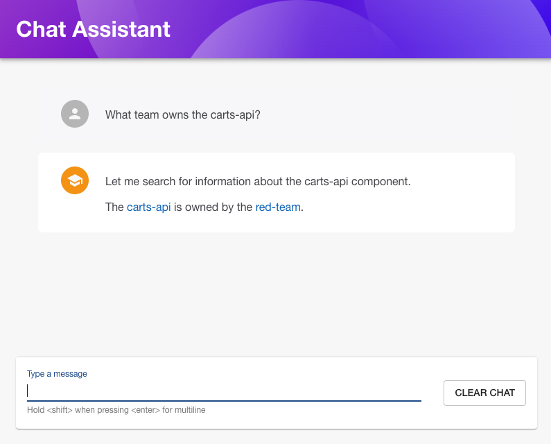

# Generative AI plugin for Backstage (Experimental)

This experimental Backstage plugin helps build generative AI assistants in a manner that can leverage the broader Backstage plugin ecosystem. It relies on "tool use" to provide LLMs with access to existing Backstage backend plugins so that the models can access data via Backstage such as the catalog, TechDocs, CI/CD, Kubernetes resources etc.

Features:

- Simple conversational chat interface
- Configure multiple AI "agents" for specific purposes
- Modular approach to providing agent implementations
- Provide "tools" to agents through Backstage extensions

[See here](https://www.youtube.com/watch?v=DCXzCrIDOAs) for the BackstageCon NA 2024 session where this idea is presented.

## Before you begin

Considerations before you explore this plugin:

1. Its experimental
1. Using this plugin will incur costs from your LLM provider, you are responsible for these
1. This plugin does not build in guardrails or other protective mechanisms against prompt injection, leaking of sensitive information etc. and you are responsible for these

## Pre-requisites

This plugin relies on external LLMs, and will generally require models that support tool-use/function-calling. Some examples of models that support this include:

1. Anthropic Claude >= 3 (Haiku, Sonnet, Opus)
1. OpenAI
1. Meta Llama (certain models)

The example LangGraph implementation provided can use:

1. [Amazon Bedrock](https://aws.amazon.com/bedrock/)
1. [OpenAI](https://openai.com/)

To explore support for other models/providers please raise a GitHub issue.

## Packages

| Package                                                    | Description                                             |
| ---------------------------------------------------------- | ------------------------------------------------------- |
| `@alithya-oss/backstage-plugins-aws-genai`                 | Frontend plugin providing the chat assistant page       |
| `@alithya-oss/backstage-plugins-aws-genai-backend`         | Backend plugin exposing the agent API                   |
| `@alithya-oss/backstage-plugins-aws-genai-node`            | Node library with the extension points and agent types  |
| `@alithya-oss/backstage-plugins-aws-genai-common`          | Types shared between the frontend and the backend       |
| `@alithya-oss/backstage-plugins-aws-genai-agent-langgraph` | LangGraph based agent implementation used by this guide |

## Documentation

1. [Installation](installation.md): install and configure the plugin and your first agent.
1. [Actions and tools](actions-and-tools.md): give agents access to Backstage data and let agents talk to each other.
1. [LangGraph agent](langgraph-agent.md): full configuration reference for the provided agent implementation.
1. [Prompting tips](prompting-tips.md): various tips on how to configure the agent system prompt.
1. [Agent implementation](agent-types.md): provide an implementation for how an agent responds to prompts.

## Provenance and attribution

These packages are a fork of the GenAI plugins from
[awslabs/backstage-plugins-for-aws](https://github.com/awslabs/backstage-plugins-for-aws/tree/main/plugins/genai),
originally published as `@aws/genai-plugin-for-backstage*`. This documentation is
derived from the upstream documentation.

Portions of this content are Copyright Amazon.com, Inc. or its affiliates, licensed
under the Apache License, Version 2.0. The fork is maintained independently in
this repository and is not supported by AWS.

| Upstream package                                  | Fork                                                       |
| ------------------------------------------------- | ---------------------------------------------------------- |
| `@aws/genai-plugin-for-backstage`                 | `@alithya-oss/backstage-plugins-aws-genai`                 |
| `@aws/genai-plugin-for-backstage-common`          | `@alithya-oss/backstage-plugins-aws-genai-common`          |
| `@aws/genai-plugin-for-backstage-node`            | `@alithya-oss/backstage-plugins-aws-genai-node`            |
| `@aws/genai-plugin-for-backstage-backend`         | `@alithya-oss/backstage-plugins-aws-genai-backend`         |
| `@aws/genai-plugin-langgraph-agent-for-backstage` | `@alithya-oss/backstage-plugins-aws-genai-agent-langgraph` |
